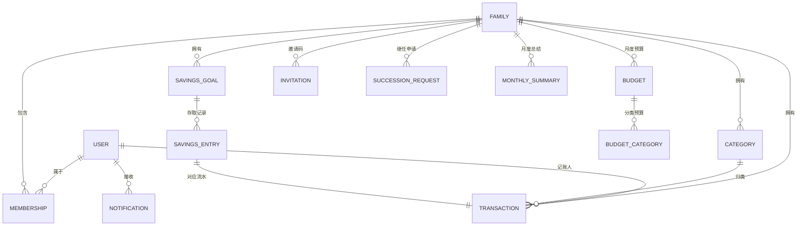

# 家账 · 数据模型文档（DATAMODEL）

> 文档版本：v0.1
> 最后更新：2026-05-31
> 关联文档：PRD.md（v0.1）对应 §18 数据模型
> 负责人：产品组 / 后端

---

## 1. 约定

### 1.1 通用字段约定

- 所有实体均含 `created_at` / `updated_at`（timestamp，UTC 存储）。
- 主键 `id` 统一使用 UUID。
- 外键命名为 `<实体>_id`。

### 1.2 金额约定（重要）

- **所有金额字段统一以「分」为单位，类型 `bigint`**，避免浮点误差。
  - 例：`¥123.45` 存为 `12345`。
- 前端负责「分 ↔ 元」换算与展示；接口传输一律传「分」。

### 1.3 删除约定

- **一律采用软删除**：通过状态字段（如 `status`、`is_deleted`）标记，不做物理删除。
  - 便于审计、纠纷追溯、离线冲突恢复。
  - 「家庭解散」「账号注销」等永久删除场景由后端按合规要求另行物理清理（见 §7）。

### 1.4 时区约定

- 时间戳以 UTC 存储；账期（预算月、月度总结、目标截止日）的「归属月/日」按 `FAMILY.timezone` 计算（见 PRD §2.5）。

---

## 2. 实体关系总览（ER 图）

---

## 3. 核心实体

### 3.1 USER（用户）

| 字段                        | 类型      | 约束      | 说明                                   |
| --------------------------- | --------- | --------- | -------------------------------------- |
| `id`                        | UUID      | PK        | 用户唯一标识                           |
| `phone`                     | string    | unique    | 手机号（登录主键）                     |
| `nickname`                  | string    | not null  | 昵称（可重复、可改，不作校验凭据）     |
| `avatar_url`                | string    | null      | 头像                                   |
| `current_family_id`         | UUID      | FK→FAMILY | 当前所属家庭（一人仅一个）             |
| `last_login_at`             | timestamp |           | 用于户主 30 天继任判定                 |
| `status`                    | enum      |           | `active` / `deactivated`（注销，远期） |
| `created_at` / `updated_at` | timestamp |           |                                        |

### 3.2 FAMILY（家庭）

| 字段                        | 类型      | 约束     | 说明                                |
| --------------------------- | --------- | -------- | ----------------------------------- |
| `id`                        | UUID      | PK       |                                     |
| `name`                      | string    | not null | 家庭名（解散二次确认凭据）          |
| `owner_user_id`             | UUID      | FK→USER  | 户主，**每家唯一**                  |
| `timezone`                  | string    | not null | 账期时区（创建时落定，见 PRD §2.5） |
| `member_count`              | int       | ≤ 8      | 冗余计数，便于上限校验              |
| `status`                    | enum      |          | `active` / `dissolved`              |
| `created_at` / `updated_at` | timestamp |          |                                     |

### 3.3 MEMBERSHIP（成员关系）

| 字段                    | 类型      | 约束 | 说明                          |
| ----------------------- | --------- | ---- | ----------------------------- |
| `id`                    | UUID      | PK   |                               |
| `family_id`             | UUID      | FK   |                               |
| `user_id`               | UUID      | FK   |                               |
| `role`                  | enum      |      | `owner` / `member`            |
| `status`                | enum      |      | `active` / `left` / `removed` |
| `joined_at` / `left_at` | timestamp |      |                               |

> **约束**：`(family_id, user_id)` 唯一；一个用户同时只能有一条 `status=active` 的成员关系（落地「一人一家」）。退出/移除时置 `left`/`removed` 而非删除（保留报表中成员名称，对应 PRD 流程 9）。

### 3.4 TRANSACTION（流水）—— 模型核心

| 字段                        | 类型      | 约束                       | 说明                                              |
| --------------------------- | --------- | -------------------------- | ------------------------------------------------- |
| `id`                        | UUID      | PK                         |                                                   |
| `family_id`                 | UUID      | FK，**创建即绑定，不可变** | 归属家庭（PRD §2.3 防串账核心）                   |
| `type`                      | enum      |                            | `expense` / `income`                              |
| `amount`                    | bigint    | > 0                        | 金额（单位：分）                                  |
| `category_id`               | UUID      | FK→CATEGORY                | 分类                                              |
| `note`                      | string    | null                       | 备注                                              |
| `occurred_at`               | timestamp |                            | 记账时间（按家庭时区归月）                        |
| `recorder_user_id`          | UUID      | FK→USER                    | 记账人                                            |
| `source`                    | enum      |                            | `normal` / `savings_deposit` / `savings_withdraw` |
| `savings_goal_id`           | UUID      | FK，null                   | 储蓄类流水关联目标                                |
| `sync_status`               | enum      |                            | `synced` / `pending`（离线队列）                  |
| `is_deleted`                | bool      | default false              | 软删除标记                                        |
| `created_at` / `updated_at` | timestamp |                            |                                                   |

> **派生规则**：`source != normal` 即「储蓄类流水」——计入收支/结余对账，但**排除于分类占比、消费趋势、预算「已用」统计**（对应 PRD 流程 7/8/9 口径）。

### 3.5 CATEGORY（分类）

| 字段        | 类型   | 约束     | 说明                                            |
| ----------- | ------ | -------- | ----------------------------------------------- |
| `id`        | UUID   | PK       |                                                 |
| `family_id` | UUID   | FK，null | null 表示系统预设全局分类                       |
| `name`      | string |          | 同家庭内不重复                                  |
| `icon`      | string |          | 图标                                            |
| `type`      | enum   |          | `expense` / `income`                            |
| `is_system` | bool   |          | 系统预设不可删，仅可隐藏                        |
| `status`    | enum   |          | `active` / `archived`（停用）/ `hidden`（隐藏） |

> 删除走软删除（`archived`），历史流水仍显示原分类名（PRD 流程 11）。预设「储蓄·目标存入 / 取出」「其他」作为系统分类内置。

---

## 4. 储蓄与预算

### 4.1 SAVINGS_GOAL（储蓄目标）

| 字段            | 类型      | 约束     | 说明                                    |
| --------------- | --------- | -------- | --------------------------------------- |
| `id`            | UUID      | PK       |                                         |
| `family_id`     | UUID      | FK       | 每家 ≤ 5 个 `active`                    |
| `name`          | string    | not null | 目标名称                                |
| `target_amount` | bigint    | > 0      | 目标金额（分）                          |
| `deadline`      | date      | null     | 截止日期，可空（无期限）                |
| `cover_url`     | string    | null     | 封面图                                  |
| `note`          | string    | null     | 备注                                    |
| `saved_amount`  | bigint    | ≥ 0      | 已存（= 存入合计 − 取出合计，单位：分） |
| `achieved_at`   | timestamp | null     | 首次达成时间（控制庆祝只触发一次）      |
| `status`        | enum      |          | `active` / `deleted`                    |
| `version`       | int       |          | 乐观锁，解决并发存取（PRD §9.7）        |

### 4.2 SAVINGS_ENTRY（存取记录）

| 字段             | 类型   | 约束            | 说明                                          |
| ---------------- | ------ | --------------- | --------------------------------------------- |
| `id`             | UUID   | PK              |                                               |
| `goal_id`        | UUID   | FK→SAVINGS_GOAL |                                               |
| `direction`      | enum   |                 | `deposit` / `withdraw`                        |
| `amount`         | bigint | > 0             | 金额（分）                                    |
| `note`           | string | null            | 用途备注                                      |
| `transaction_id` | UUID   | FK→TRANSACTION  | **对应生成的那笔流水**（方案 B 资金闭环关键） |

### 4.3 BUDGET（月度总预算）

| 字段            | 类型   | 约束         | 说明              |
| --------------- | ------ | ------------ | ----------------- |
| `id`            | UUID   | PK           |                   |
| `family_id`     | UUID   | FK           |                   |
| `period`        | string | `YYYY-MM`    | 按自然月，不结转  |
| `total_amount`  | bigint | > 0          | 总预算（分）      |
| `alert_enabled` | bool   | default true | 是否启用 80% 预警 |

> 「已用」金额为实时聚合，= 当期 `type=expense AND source=normal AND is_deleted=false` 流水合计（排除储蓄类流水）。

### 4.4 BUDGET_CATEGORY（分类预算）

| 字段          | 类型   | 约束        | 说明           |
| ------------- | ------ | ----------- | -------------- |
| `id`          | UUID   | PK          |                |
| `budget_id`   | UUID   | FK→BUDGET   |                |
| `category_id` | UUID   | FK→CATEGORY |                |
| `amount`      | bigint | > 0         | 分类预算（分） |

> 分类预算可选，合计可超总预算（仅警告，PRD §10.6）。

---

## 5. 辅助实体

### 5.1 INVITATION（邀请码）

| 字段         | 类型      | 约束   | 说明                            |
| ------------ | --------- | ------ | ------------------------------- |
| `id`         | UUID      | PK     |                                 |
| `family_id`  | UUID      | FK     |                                 |
| `code`       | string    | unique | 邀请码内容                      |
| `expires_at` | timestamp |        | 24 小时有效期                   |
| `status`     | enum      |        | `valid` / `revoked` / `expired` |

### 5.2 SUCCESSION_REQUEST（户主继任申请）

| 字段                 | 类型      | 约束    | 说明                                              |
| -------------------- | --------- | ------- | ------------------------------------------------- |
| `id`                 | UUID      | PK      |                                                   |
| `family_id`          | UUID      | FK      |                                                   |
| `applicant_user_id`  | UUID      | FK→USER | 发起继任的成员                                    |
| `objection_deadline` | timestamp |         | 原户主 7 天异议期截止                             |
| `status`             | enum      |         | `pending` / `approved` / `rejected` / `cancelled` |

> 约束：同一家庭异议期内仅允许一条 `pending` 申请（以首个为准，PRD §7.6）。

### 5.3 NOTIFICATION（通知）

| 字段      | 类型      | 约束    | 说明                                                                                         |
| --------- | --------- | ------- | -------------------------------------------------------------------------------------------- |
| `id`      | UUID      | PK      |                                                                                              |
| `user_id` | UUID      | FK→USER | 接收者                                                                                       |
| `type`    | enum      |         | `removed` / `transfer` / `succession` / `goal_achieved` / `budget_alert` / `monthly_summary` |
| `channel` | enum      |         | `in_app` / `push`                                                                            |
| `payload` | json      | null    | 事件附加数据                                                                                 |
| `read_at` | timestamp | null    | 已读时间                                                                                     |

### 5.4 MONTHLY_SUMMARY（月度总结，快照存储）

> 采用**生成时快照存储**，避免成员变动后重算导致口径漂移。

| 字段                 | 类型      | 约束      | 说明                                             |
| -------------------- | --------- | --------- | ------------------------------------------------ |
| `id`                 | UUID      | PK        |                                                  |
| `family_id`          | UUID      | FK        |                                                  |
| `period`             | string    | `YYYY-MM` | 所属月份                                         |
| `total_expense`      | bigint    |           | 总支出（分，排除储蓄类流水的消费口径见 PRD §11） |
| `total_income`       | bigint    |           | 总收入（分）                                     |
| `balance`            | bigint    |           | 结余（分）                                       |
| `max_single_expense` | json      |           | 最大单笔（金额 / 分类 / 日期 快照）              |
| `top_category`       | json      |           | 支出最高分类（名称 / 金额 / 占比 快照）          |
| `top_recorder`       | json      |           | 记账最积极的人（昵称 / 笔数 快照）               |
| `mom_compare`        | json      |           | 环比上月（支出 / 收入 增减 快照）                |
| `warm_text`          | string    |           | 暖心文案（生成时随机落定）                       |
| `generated_at`       | timestamp |           | 生成时间                                         |

---

## 6. 关键约束清单（落地规则）

| 规则来源            | 约束                                    |
| ------------------- | --------------------------------------- |
| PRD §2.2 一人一家   | 每用户仅一条 `MEMBERSHIP.status=active` |
| PRD §2.3 数据归家   | `TRANSACTION.family_id` 创建后不可变    |
| PRD §2.2 成员上限   | `FAMILY.member_count ≤ 8`               |
| PRD §5 户主唯一     | 每家 `role=owner` 仅一条 active         |
| PRD §9.3 目标上限   | 每家 `status=active` 的 goal ≤ 5        |
| PRD §9.7 并发       | `SAVINGS_GOAL.version` 乐观锁           |
| PRD §7/8/9 储蓄口径 | `source != normal` 排除于消费分析与预算 |
| PRD §7.6 继任       | 同家庭异议期内仅一条 `pending` 继任申请 |

---

## 7. 永久删除场景（合规物理清理）

> 区别于常规软删除，以下场景按合规要求做物理清理（可异步执行）：

| 场景             | 处理                                                                                               |
| ---------------- | -------------------------------------------------------------------------------------------------- |
| 家庭解散         | 该家庭全部 TRANSACTION / SAVINGS*\* / BUDGET*\* / CATEGORY / MONTHLY_SUMMARY / INVITATION 永久删除 |
| 账号注销（远期） | 用户个人账号数据删除；其历史流水按「数据归家」保留在原家庭（仅解绑个人可见性）                     |

---

## 8. 枚举值汇总

| 枚举                        | 取值                                                                                         |
| --------------------------- | -------------------------------------------------------------------------------------------- |
| `USER.status`               | `active` / `deactivated`                                                                     |
| `FAMILY.status`             | `active` / `dissolved`                                                                       |
| `MEMBERSHIP.role`           | `owner` / `member`                                                                           |
| `MEMBERSHIP.status`         | `active` / `left` / `removed`                                                                |
| `TRANSACTION.type`          | `expense` / `income`                                                                         |
| `TRANSACTION.source`        | `normal` / `savings_deposit` / `savings_withdraw`                                            |
| `TRANSACTION.sync_status`   | `synced` / `pending`                                                                         |
| `CATEGORY.type`             | `expense` / `income`                                                                         |
| `CATEGORY.status`           | `active` / `archived` / `hidden`                                                             |
| `SAVINGS_GOAL.status`       | `active` / `deleted`                                                                         |
| `SAVINGS_ENTRY.direction`   | `deposit` / `withdraw`                                                                       |
| `SUCCESSION_REQUEST.status` | `pending` / `approved` / `rejected` / `cancelled`                                            |
| `INVITATION.status`         | `valid` / `revoked` / `expired`                                                              |
| `NOTIFICATION.type`         | `removed` / `transfer` / `succession` / `goal_achieved` / `budget_alert` / `monthly_summary` |
| `NOTIFICATION.channel`      | `in_app` / `push`                                                                            |
