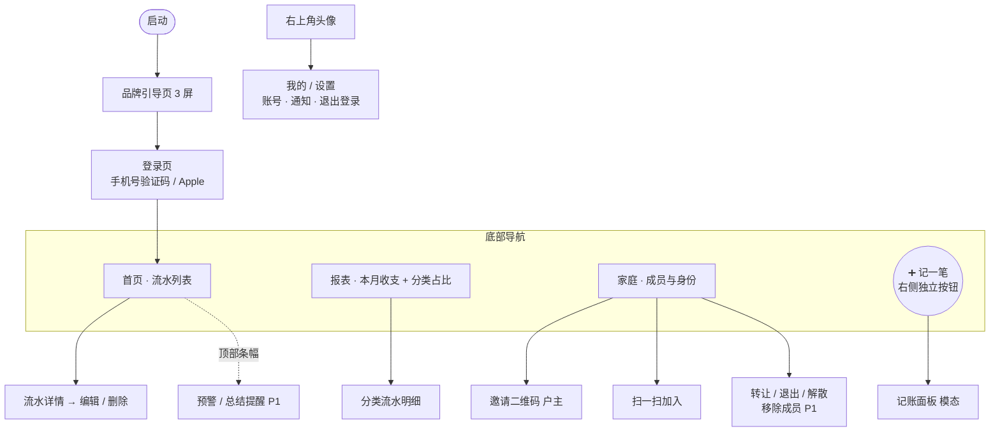

# 家账 · 信息架构与页面地图（IA）

> 文档版本：v0.1
> 最后更新：2026-05-31
> 关联文档：PRD.md（v0.1）对应 §17、MVP.md（v0.1）、DATAMODEL.md（v0.1）
> 负责人：产品组 / 设计

---

## 1. 设计基线

- **目标平台**：iOS App。
- **设计规范**：全部 UI 以 **iOS 26 设计规范（HIG）** 为准，包括导航、组件、间距、字体、动效与配色。
- 本文档只定义信息架构与页面骨架，**不约束具体视觉**；后续可由 PRD.md + MVP.md + 本文档驱动生成具体 UI 图。

---

## 2. 全局导航结构

参照 iOS 26 的底部导航形态（Tab Bar + 右侧独立圆形操作按钮，类似系统 App 的「搜索」按钮位置）：

- **顶栏**：左侧为页面标题，右上角为用户头像 → 进入「我的 / 设置」。
- **底部导航**：3 个 Tab + **右侧独立的圆形 ➕ 按钮（记一笔，主操作）**。
  - ➕ 按钮**独立于 Tab 组**，置于底栏右侧，不占用 Tab 位、不居中。

```
┌─────────────────────────────┐
│  首页                [头像] │  ← 顶栏（标题 + 右上角头像）
│                             │
│         （页面内容）         │
│                             │
├─────────────────────────────┤
│  🏠首页  📊报表  👨‍👩‍👧家庭      ( ➕ ) │  ← 3 Tab 在左，➕ 独立圆形按钮在右
└─────────────────────────────┘
```

| 区域 | 元素 | 作用 |
| --- | --- | --- |
| 顶栏右上 | 头像 | 进入「我的 / 设置」 |
| 底栏左侧 | 首页 / 报表 / 家庭（3 Tab） | 主导航 |
| 底栏右侧 | ➕ 独立圆形按钮 | 记一笔（主操作） |

---

## 3. 页面地图（MVP P0 范围）



---

## 4. 各位置内容速览

| 位置 | 页面 | 对应流程 | MVP |
| --- | --- | --- | --- |
| 顶栏右上 | 我的 / 设置 | 账号信息、退出登录、通知 | P0（注销远期） |
| Tab 首页 | 流水列表（按日分组）+ 流水详情 / 编辑 / 删除 | 流程 2 / 10 | P0 |
| 右侧 ➕ | 记账面板（模态弹出） | 流程 2 | P0 |
| Tab 报表 | 本月收入 / 支出 / 结余 + 分类占比环形图 | 流程 9（基础版） | P0 |
| Tab 家庭 | 成员列表、邀请、扫码加入、转让 / 退出 / 解散 | 流程 3 / 4 / 5 | P0 |
| 家庭（户主） | 移除成员 | 流程 6 | P1 |
| 全局 | App 内通知条幅 / 被移除全屏提示 | 流程 13 | P0（关键子集） |
| 后续 | 预算、储蓄目标、月度总结卡 | 流程 7 / 8 / 9 | P1 |

---

## 5. 说明与待定

- 预算、储蓄目标到 P1 时，可作为「家庭」页内的入口或新增 Tab；**届时底部是否扩成 4 Tab 再定**（注意 iOS 26 下 Tab 数量与右侧 ➕ 按钮的布局平衡）。
- 「扫一扫」入口建议同时放在「家庭页」和「我的页」。
- 顶部条幅（预算预警 / 月度总结提醒）属 P1，P0 阶段首页顶部保持简洁。
