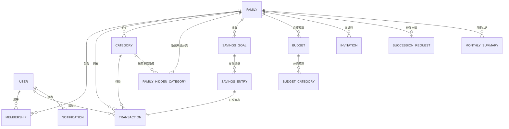

# 家账 · 数据模型文档（DATAMODEL）

> 文档版本：v0.1.1（FAMILY 新增 `cover_url` 家庭封面；INVITATION.code 明确为 6 位大写字母数字、排除易混字符——支撑加入家庭手输码与预览卡，详见 PRD 流程 3/4、§3.5）
> 最后更新：2026-06-21
> 关联文档：PRD.md（§18 数据模型；流程 3/4、§3.5）
> 负责人：产品组 / 后端

---

## 1. 约定

### 1.1 通用字段约定

- 所有实体均含 `created_at` / `updated_at`（timestamp，UTC 存储）。
- 主键 `id` 统一使用 UUID。
- 外键命名为 `<实体>_id`。

### 1.2 金额约定（重要）

- **所有金额字段统一以「分」为单位，类型 `bigint`**，避免浮点误差。
  - 例：`¥123.45` 存为 `12345`。
- 前端负责「分 ↔ 元」换算与展示；接口传输一律传「分」。

### 1.3 删除约定

- **一律采用软删除**：通过状态字段（如 `status`、`is_deleted`）标记，不做物理删除。
  - 便于审计、纠纷追溯、离线冲突恢复。
  - 「家庭解散」「账号注销」等永久删除场景由后端按合规要求另行物理清理（见 §7）。

### 1.4 时区约定

- 时间戳以 UTC 存储；账期（预算月、月度总结、目标截止日）的「归属月/日」按 `FAMILY.timezone` 计算（见 PRD §2.5）。

---

## 2. 实体关系总览（ER 图）

---

## 3. 核心实体

### 3.1 USER（用户）

| 字段                        | 类型      | 约束      | 说明                                   |
| --------------------------- | --------- | --------- | -------------------------------------- |
| `id`                        | UUID      | PK        | 用户唯一标识                           |
| `phone`                     | string    | unique    | 手机号（登录主键）                     |
| `nickname`                  | string    | not null  | 昵称（可重复、可改，不作校验凭据）     |
| `avatar_url`                | string    | null      | 头像                                   |
| `current_family_id`         | UUID      | FK→FAMILY | 当前所属家庭（一人仅一个）             |
| `last_login_at`             | timestamp |           | 用于户主 30 天继任判定                 |
| `status`                    | enum      |           | `active` / `deactivated`（注销，远期） |
| `created_at` / `updated_at` | timestamp |           |                                        |

### 3.2 FAMILY（家庭）

| 字段                        | 类型      | 约束     | 说明                                                                                                       |
| --------------------------- | --------- | -------- | ---------------------------------------------------------------------------------------------------------- |
| `id`                        | UUID      | PK       |                                                                                                            |
| `name`                      | string    | not null | 家庭名（解散二次确认凭据）                                                                                 |
| `cover_url`                 | string    | null     | 家庭封面图（阿里云 OSS）；无封面时前端用暖色默认底 / 插画占位（加入预览卡、家庭页头用，PRD §3.5 / 流程 4） |
| `owner_user_id`             | UUID      | FK→USER  | 户主，**每家唯一**                                                                                         |
| `timezone`                  | string    | not null | 账期时区（创建时落定，见 PRD §2.5）                                                                        |
| `member_count`              | int       | ≤ 8      | 冗余计数，便于上限校验                                                                                     |
| `status`                    | enum      |          | `active` / `dissolved`                                                                                     |
| `created_at` / `updated_at` | timestamp |          |                                                                                                            |

### 3.3 MEMBERSHIP（成员关系）

| 字段                    | 类型      | 约束 | 说明                          |
| ----------------------- | --------- | ---- | ----------------------------- |
| `id`                    | UUID      | PK   |                               |
| `family_id`             | UUID      | FK   |                               |
| `user_id`               | UUID      | FK   |                               |
| `role`                  | enum      |      | `owner` / `member`            |
| `status`                | enum      |      | `active` / `left` / `removed` |
| `joined_at` / `left_at` | timestamp |      |                               |

> **约束**：`(family_id, user_id)` 唯一；一个用户同时只能有一条 `status=active` 的成员关系（落地「一人一家」）。退出/移除时置 `left`/`removed` 而非删除（保留报表中成员名称，对应 PRD 流程 9）。

### 3.4 TRANSACTION（流水）—— 模型核心

| 字段                        | 类型      | 约束                       | 说明                                              |
| --------------------------- | --------- | -------------------------- | ------------------------------------------------- |
| `id`                        | UUID      | PK                         |                                                   |
| `family_id`                 | UUID      | FK，**创建即绑定，不可变** | 归属家庭（PRD §2.3 防串账核心）                   |
| `type`                      | enum      |                            | `expense` / `income`                              |
| `amount`                    | bigint    | > 0                        | 金额（单位：分）                                  |
| `category_id`               | UUID      | FK→CATEGORY                | 分类                                              |
| `note`                      | string    | null                       | 备注                                              |
| `occurred_at`               | timestamp |                            | 记账时间（按家庭时区归月）                        |
| `recorder_user_id`          | UUID      | FK→USER                    | 记账人                                            |
| `source`                    | enum      |                            | `normal` / `savings_deposit` / `savings_withdraw` |
| `savings_goal_id`           | UUID      | FK，null                   | 储蓄类流水关联目标                                |
| `sync_status`               | enum      |                            | `synced` / `pending`（离线队列）                  |
| `is_deleted`                | bool      | default false              | 软删除标记                                        |
| `created_at` / `updated_at` | timestamp |                            |                                                   |

> **派生规则**：`source != normal` 即「储蓄类流水」——计入收支/结余对账，但**排除于分类占比、消费趋势、预算「已用」统计**（对应 PRD 流程 7/8/9 口径）。

### 3.5 CATEGORY（分类）

| 字段        | 类型   | 约束     | 说明                                            |
| ----------- | ------ | -------- | ----------------------------------------------- |
| `id`        | UUID   | PK       |                                                 |
| `family_id` | UUID   | FK，null | null 表示系统预设全局分类                       |
| `name`      | string |          | 同家庭内不重复                                  |
| `icon`      | string |          | 图标                                            |
| `type`      | enum   |          | `expense` / `income`                            |
| `is_system` | bool   |          | 系统预设不可删，仅可隐藏                        |
| `status`    | enum   |          | `active` / `archived`（停用）/ `hidden`（隐藏） |

> 删除走软删除（`archived`），历史流水仍显示原分类名（PRD 流程 11）。预设「储蓄·目标存入 / 取出」「其他」作为系统分类内置。

### 3.5.1 FAMILY_HIDDEN_CATEGORY（家庭隐藏的系统分类 · PRD 流程 11 / MVP §2.4）

系统预设分类是全局单行（`CATEGORY.family_id = null`），无法用 `CATEGORY.status='hidden'` 做「按家庭隐藏」——置全局行 `hidden` 会对所有家庭生效。故用本覆盖表：一行 = 「该家庭在记账/预算选择器中隐藏了该系统分类」，全局分类行保持 `active`，**历史流水仍能解析其名称/图标（显示零回归）**。

| 字段          | 类型        | 约束                        | 说明                                       |
| ------------- | ----------- | --------------------------- | ------------------------------------------ |
| `family_id`   | UUID        | PK, FK→FAMILY(on delete cascade)   | 哪个家庭                            |
| `category_id` | UUID        | PK, FK→CATEGORY(on delete cascade) | 被隐藏的系统分类（触发器校验须为系统分类） |
| `created_at`  | timestamptz | default now()               |                                            |

> 仅系统分类可入此表（`before insert` 触发器校验 `family_id is null and is_system`）；自定义分类的删除仍走 `CATEGORY.status='archived'`。「其他支出 / 其他收入」作兜底，前端不提供隐藏入口；「储蓄·\*」从分类管理列表过滤。RLS：家庭成员可读/增/删本家庭覆盖行，户主门禁在前端（与停用自定义分类一致）。

---

## 4. 储蓄与预算

### 4.1 SAVINGS_GOAL（储蓄目标）

| 字段            | 类型      | 约束     | 说明                                    |
| --------------- | --------- | -------- | --------------------------------------- |
| `id`            | UUID      | PK       |                                         |
| `family_id`     | UUID      | FK       | 每家 ≤ 5 个 `active`                    |
| `name`          | string    | not null | 目标名称                                |
| `target_amount` | bigint    | > 0      | 目标金额（分）                          |
| `deadline`      | date      | null     | 截止日期，可空（无期限）                |
| `cover_url`     | string    | null     | 封面图                                  |
| `note`          | string    | null     | 备注                                    |
| `saved_amount`  | bigint    | ≥ 0      | 已存（= 存入合计 − 取出合计，单位：分） |
| `achieved_at`   | timestamp | null     | 首次达成时间（控制庆祝只触发一次）      |
| `status`        | enum      |          | `active` / `deleted`                    |
| `version`       | int       |          | 乐观锁，解决并发存取（PRD §9.7）        |

### 4.2 SAVINGS_ENTRY（存取记录）

| 字段             | 类型   | 约束            | 说明                                          |
| ---------------- | ------ | --------------- | --------------------------------------------- |
| `id`             | UUID   | PK              |                                               |
| `goal_id`        | UUID   | FK→SAVINGS_GOAL |                                               |
| `direction`      | enum   |                 | `deposit` / `withdraw`                        |
| `amount`         | bigint | > 0             | 金额（分）                                    |
| `note`           | string | null            | 用途备注                                      |
| `transaction_id` | UUID   | FK→TRANSACTION  | **对应生成的那笔流水**（方案 B 资金闭环关键） |

### 4.3 BUDGET（月度总预算）

| 字段            | 类型   | 约束         | 说明              |
| --------------- | ------ | ------------ | ----------------- |
| `id`            | UUID   | PK           |                   |
| `family_id`     | UUID   | FK           |                   |
| `period`        | string | `YYYY-MM`    | 按自然月，不结转  |
| `total_amount`  | bigint | > 0          | 总预算（分）      |
| `alert_enabled` | bool   | default true | 是否启用 80% 预警 |

> 「已用」金额为实时聚合，= 当期 `type=expense AND source=normal AND is_deleted=false` 流水合计（排除储蓄类流水）。

### 4.4 BUDGET_CATEGORY（分类预算）

| 字段          | 类型   | 约束        | 说明           |
| ------------- | ------ | ----------- | -------------- |
| `id`          | UUID   | PK          |                |
| `budget_id`   | UUID   | FK→BUDGET   |                |
| `category_id` | UUID   | FK→CATEGORY |                |
| `amount`      | bigint | > 0         | 分类预算（分） |

> 分类预算可选，合计可超总预算（仅警告，PRD §10.6）。

---

## 5. 辅助实体

### 5.1 INVITATION（邀请码）

| 字段         | 类型      | 约束   | 说明                                                                        |
| ------------ | --------- | ------ | --------------------------------------------------------------------------- |
| `id`         | UUID      | PK     |                                                                             |
| `family_id`  | UUID      | FK     |                                                                             |
| `code`       | string    | unique | 邀请码：**6 位，大写 A–Z + 数字 0–9，排除易混 `0/O/1/I`**；手输与二维码同源 |
| `expires_at` | timestamp |        | 24 小时有效期                                                               |
| `status`     | enum      |        | `valid` / `revoked` / `expired`                                             |

> 凭 `code` 换取家庭预览（`preview_family_by_code`，只读、在线、限频）与执行加入（`join_family_by_code`）；户主权限变更 / 刷新即令旧码 `revoked`（PRD §5、TECH §7.3）。

### 5.2 SUCCESSION_REQUEST（户主继任申请）

| 字段                 | 类型      | 约束    | 说明                                              |
| -------------------- | --------- | ------- | ------------------------------------------------- |
| `id`                 | UUID      | PK      |                                                   |
| `family_id`          | UUID      | FK      |                                                   |
| `applicant_user_id`  | UUID      | FK→USER | 发起继任的成员                                    |
| `objection_deadline` | timestamp |         | 原户主 7 天异议期截止                             |
| `status`             | enum      |         | `pending` / `approved` / `rejected` / `cancelled` |

> 约束：同一家庭异议期内仅允许一条 `pending` 申请（以首个为准，PRD §7.6）。

### 5.3 NOTIFICATION（通知）

| 字段      | 类型      | 约束    | 说明                                                                                         |
| --------- | --------- | ------- | -------------------------------------------------------------------------------------------- |
| `id`      | UUID      | PK      |                                                                                              |
| `user_id` | UUID      | FK→USER | 接收者                                                                                       |
| `type`    | enum      |         | `removed` / `transfer` / `succession` / `goal_achieved` / `budget_alert` / `monthly_summary` |
| `channel` | enum      |         | `in_app` / `push`                                                                            |
| `payload` | json      | null    | 事件附加数据                                                                                 |
| `read_at` | timestamp | null    | 已读时间                                                                                     |

### 5.4 MONTHLY_SUMMARY（月度总结，快照存储）

> 采用**生成时快照存储**，避免成员变动后重算导致口径漂移。
> **落地阶段（2026-06-21）**：MVP 期月度总结为**客户端实时计算**（见报表实现），本快照表 + pg_cron 生成 + 「保存图片」**移至发布前补齐**（MVP §2.4）。

| 字段                 | 类型      | 约束      | 说明                                             |
| -------------------- | --------- | --------- | ------------------------------------------------ |
| `id`                 | UUID      | PK        |                                                  |
| `family_id`          | UUID      | FK        |                                                  |
| `period`             | string    | `YYYY-MM` | 所属月份                                         |
| `total_expense`      | bigint    |           | 总支出（分，排除储蓄类流水的消费口径见 PRD §11） |
| `total_income`       | bigint    |           | 总收入（分）                                     |
| `balance`            | bigint    |           | 结余（分）                                       |
| `max_single_expense` | json      |           | 最大单笔（金额 / 分类 / 日期 快照）              |
| `top_category`       | json      |           | 支出最高分类（名称 / 金额 / 占比 快照）          |
| `top_recorder`       | json      |           | 记账最积极的人（昵称 / 笔数 快照）               |
| `mom_compare`        | json      |           | 环比上月（支出 / 收入 增减 快照）                |
| `warm_text`          | string    |           | 暖心文案（生成时随机落定）                       |
| `generated_at`       | timestamp |           | 生成时间                                         |

### 5.5 FEEDBACK（意见反馈 · PRD §18.3.7）

> 用户主动提交的问题 / 建议。MVP 单向提交：客户端只 insert（走 `submit_feedback` RPC），不读回历史；运营侧经 service_role 查看跟进。

| 字段          | 类型          | 约束                                                      | 说明                                                             |
| ------------- | ------------- | --------------------------------------------------------- | ---------------------------------------------------------------- |
| `id`          | UUID          | PK                                                        |                                                                  |
| `user_id`     | UUID          | FK→USER, not null                                         | 提交者（服务端由 `auth.uid()` 落定，客户端不可传）              |
| `family_id`   | UUID          | FK→FAMILY, null                                           | 提交时的当前家庭快照（便于复现家庭态问题）                       |
| `type`        | enum          | `feature`/`bug`/`suggestion`/`other`                     | 反馈类型（对应 UI「功能 / Bug / 建议 / 其它」）                  |
| `content`     | string        | not null, `trim` 后 5–200 字                              | 问题描述                                                         |
| `image_paths` | text[]        | default `{}`，≤ 5                                         | `homebook-feedback-images` 桶内对象路径（`{userId}_{uuid}.jpg`） |
| `contact_ok`  | bool          | default true                                              | 是否同意通过账号（手机 / 邮箱）回访                              |
| `device`      | jsonb         |                                                           | 诊断信息：`app_version`/`build`/`platform`/`os_version`/`device_model`/`brand`/`timezone` |
| `status`      | enum          | `open`/`in_progress`/`resolved`/`closed`，default `open` | 运营侧流转态（MVP 客户端不展示）                                 |
| `created_at` / `updated_at` | timestamp |                                              |                                                                  |

**防刷**：`submit_feedback` RPC 服务端校验相邻两条最短间隔 30s、每人每日 ≤ 20 条。

### 5.6 NOTIFICATION_PREFERENCE（通知偏好 · PRD §18.3.3）

> 每用户一行、六列布尔的通知分类开关。客户端直读 + `upsert`（`onConflict = user_id`），RLS 仅本人可读写。行不存在（老用户 / 从未改过）→ 客户端回落**全开**默认。本表只落用户「愿不愿收该类系统推送」的意愿，App 内通知中心不受影响；系统推送落地后由投递侧读取本表决定是否推送对应分类。

| 字段                | 类型      | 约束                              | 说明                                          |
| ------------------- | --------- | --------------------------------- | --------------------------------------------- |
| `user_id`           | UUID      | PK, FK→USER, on delete cascade    | 接收者（注销时随账号级联删除）                |
| `family_activity`   | bool      | not null, default true            | 家庭动态（被移出 / 户主变更等，见 §15 事件）  |
| `budget_alert`      | bool      | not null, default true            | 预算超支预警                                  |
| `savings_progress`  | bool      | not null, default true            | 储蓄目标进展                                  |
| `monthly_summary`   | bool      | not null, default true            | 月度总结提醒                                  |
| `member_change`     | bool      | not null, default true            | 成员与邀请变动                                |
| `account_security`  | bool      | not null, default true            | 账号安全                                      |
| `created_at` / `updated_at` | timestamp |                           |                                               |

**RLS**：`select` / `insert` / `update` 三条本人策略（`user_id = auth.uid()`）；无 delete 策略（随账号级联）。

### 5.7 DEVICE_TOKEN（推送设备令牌 · PRD §18.3.3 层级二）

> 每台设备一行的推送令牌，供服务端投递侧按 `notification_preferences` 决定后向该用户的设备发系统推送。**一台设备一行**（`token` 作主键）：同设备换登录用户时该行改挂新 `user_id`（设备只推给当前登录者）。客户端登录后注册、登出/注销时注销，均走 **SECURITY DEFINER RPC**（`register_device_token` / `unregister_device_token`，绕开「换用户认领他人行」的 RLS 死角）；投递侧以 `service_role` 读。**层级二 · 令牌获取（`getExpoPushTokenAsync` / APNs）依赖付费 Apple Developer + Push 能力**，故本表 + RPC 的落库链路先建、由客户端 `PUSH_DELIVERY_ENABLED` 开关灰度（默认关，配好 APNs 后开）。

| 字段         | 类型      | 约束                              | 说明                                              |
| ------------ | --------- | --------------------------------- | ------------------------------------------------- |
| `token`      | text      | PK                                | Expo push token 或 APNs device token（设备唯一）  |
| `user_id`    | UUID      | FK→USER, not null, on delete cascade | 当前登录者（注销随账号级联删除）               |
| `platform`   | text      | `ios` / `android`                 | 设备平台                                          |
| `provider`   | text      | `expo` / `apns`，default `expo`   | 令牌类型（Expo 推送服务 / 直连 APNs）             |
| `created_at` / `updated_at` | timestamp |                     |                                                   |

**RLS**：仅 `select` 本人策略（`user_id = auth.uid()`，便于客户端自查）；写（注册/注销）只走上述两个 RPC，投递读走 `service_role`。

---

## 6. 关键约束清单（落地规则）

| 规则来源            | 约束                                    |
| ------------------- | --------------------------------------- |
| PRD §2.2 一人一家   | 每用户仅一条 `MEMBERSHIP.status=active` |
| PRD §2.3 数据归家   | `TRANSACTION.family_id` 创建后不可变    |
| PRD §2.2 成员上限   | `FAMILY.member_count ≤ 8`               |
| PRD §5 户主唯一     | 每家 `role=owner` 仅一条 active         |
| PRD §9.3 目标上限   | 每家 `status=active` 的 goal ≤ 5        |
| PRD §9.7 并发       | `SAVINGS_GOAL.version` 乐观锁           |
| PRD §7/8/9 储蓄口径 | `source != normal` 排除于消费分析与预算 |
| PRD §7.6 继任       | 同家庭异议期内仅一条 `pending` 继任申请 |

---

## 7. 永久删除场景（合规物理清理）

> 区别于常规软删除，以下场景按合规要求做物理清理（可异步执行）：

| 场景             | 处理                                                                                               |
| ---------------- | -------------------------------------------------------------------------------------------------- |
| 家庭解散         | 该家庭全部 TRANSACTION / SAVINGS*\* / BUDGET*\* / CATEGORY / MONTHLY_SUMMARY / INVITATION 永久删除 |
| 账号注销（远期） | 用户个人账号数据删除；其历史流水按「数据归家」保留在原家庭（仅解绑个人可见性）                     |

---

## 8. 枚举值汇总

| 枚举                        | 取值                                                                                         |
| --------------------------- | -------------------------------------------------------------------------------------------- |
| `USER.status`               | `active` / `deactivated`                                                                     |
| `FAMILY.status`             | `active` / `dissolved`                                                                       |
| `MEMBERSHIP.role`           | `owner` / `member`                                                                           |
| `MEMBERSHIP.status`         | `active` / `left` / `removed`                                                                |
| `TRANSACTION.type`          | `expense` / `income`                                                                         |
| `TRANSACTION.source`        | `normal` / `savings_deposit` / `savings_withdraw`                                            |
| `TRANSACTION.sync_status`   | `synced` / `pending`                                                                         |
| `CATEGORY.type`             | `expense` / `income`                                                                         |
| `CATEGORY.status`           | `active` / `archived` / `hidden`                                                             |
| `SAVINGS_GOAL.status`       | `active` / `deleted`                                                                         |
| `FEEDBACK.type`             | `feature` / `bug` / `suggestion` / `other`                                                   |
| `FEEDBACK.status`           | `open` / `in_progress` / `resolved` / `closed`                                               |
| `SAVINGS_ENTRY.direction`   | `deposit` / `withdraw`                                                                       |
| `SUCCESSION_REQUEST.status` | `pending` / `approved` / `rejected` / `cancelled`                                            |
| `INVITATION.status`         | `valid` / `revoked` / `expired`                                                              |
| `NOTIFICATION.type`         | `removed` / `transfer` / `succession` / `goal_achieved` / `budget_alert` / `monthly_summary` |
| `NOTIFICATION.channel`      | `in_app` / `push`                                                                            |
