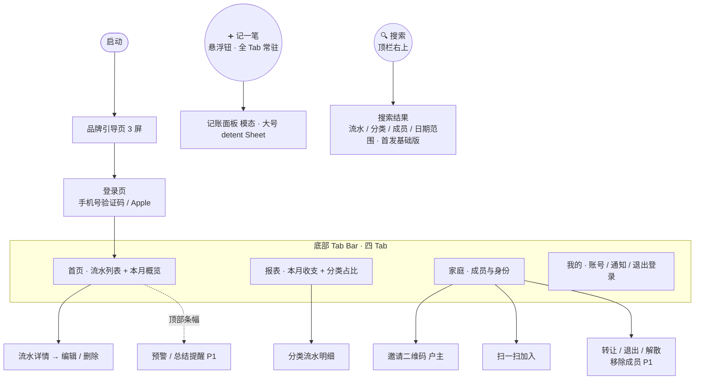

# 家账 · 信息架构与页面地图（IA）

> 文档版本：v0.2.0（导航重构为四 Tab + 记一笔浮钮 + 顶栏搜索；首页新增本月概览 / 月份切换 / 当日小计；同步 DESIGN v0.4.0）
> 最后更新：2026-06-06
> 关联文档：PRD.md（v0.1.1）对应 §17、MVP.md、DATAMODEL.md、DESIGN.md（v0.4.0，§5.2）
> 负责人：产品组 / 设计

---

## 1. 设计基线

- **目标平台**：iOS App。
- **设计规范**：全部 UI 以 **iOS 26 设计规范（HIG）** 为准，包括导航、组件、间距、字体、动效与配色。
- 本文档只定义信息架构与页面骨架，**不约束具体视觉**；后续可由 PRD.md + MVP.md + 本文档驱动生成具体 UI 图。

---

## 2. 全局导航结构

参照 iOS 26 标准底部 Tab Bar 规范（HIG），四 Tab + 悬浮主操作钮（详见 DESIGN §5.2）：

- **顶栏**：左上角为当前 Tab 名称标题；右上角为 **🔍 搜索图标**（点击进入搜索页）。**「我的」Tab 除外**——该页顶部为个人资料头，不放标题。
- **底部 Tab Bar**（标准四 Tab）：**首页 / 报表 / 家庭 / 我的**（SF Symbols 图标 + 文字标签）。
- **「➕ 记一笔」悬浮圆钮**：固定在 Tab Bar **右上方**（参照 iOS「提醒事项」新建钮），强调色实底 + 白色 ➕；**四 Tab 下常驻、语义统一为打开记账面板**，不随 Tab 变化。
- **今日格言**：不再在底部展示，移入记账面板顶部（DESIGN §5.3）。

```
┌─────────────────────────────┐
│  首页                [ 🔍 ] │  ← 顶栏（左上 Tab 名 + 右上搜索图标）
│                             │
│         （页面内容）         │
│                       ( ➕ ) │  ← 记一笔 悬浮圆钮（Tab Bar 右上方）
├─────────────────────────────┤
│  🏠首页  📊报表  👨‍👩‍👧家庭  👤我的 │  ← 标准四 Tab
└─────────────────────────────┘
```

| 区域           | 元素                               | 作用                                        |
| -------------- | ---------------------------------- | ------------------------------------------- |
| 顶栏左上       | 当前 Tab 名标题（「我的」除外）    | 页面标识                                    |
| 顶栏右上       | 🔍 搜索图标                        | 进入搜索页（流水 / 分类 / 成员 / 日期范围） |
| 底部 Tab Bar   | 首页 / 报表 / 家庭 / 我的（4 Tab） | 主导航                                      |
| Tab Bar 右上方 | ➕ 记一笔 悬浮圆钮                 | 记一笔（主操作），全 Tab 常驻               |

---

## 3. 页面地图（MVP P0 范围）



---

## 4. 各位置内容速览

| 位置              | 页面                                                                                       | 对应流程         | MVP            |
| ----------------- | ------------------------------------------------------------------------------------------ | ---------------- | -------------- |
| 顶栏右上 🔍       | 搜索页（流水 / 分类 / 成员 / 日期范围，首发基础版）                                        | —                | P0             |
| Tab Bar 右上方 ➕ | 记账面板（模态弹出，大号 detent Sheet）                                                    | 流程 2           | P0             |
| Tab 首页          | 流水列表（按日分组，日期头含当日小计）+ 本月收支概览卡（月份切换）+ 流水详情 / 编辑 / 删除 | 流程 2 / 10      | P0             |
| Tab 报表          | 本月收入 / 支出 / 结余 + 分类占比环形图                                                    | 流程 9（基础版） | P0             |
| Tab 家庭          | 成员列表、邀请、扫码加入、转让 / 退出 / 解散                                               | 流程 3 / 4 / 5   | P0             |
| Tab 我的          | 账号信息、通知设置、退出登录（注销远期）                                                   | —                | P0（注销远期） |
| 家庭（户主）      | 移除成员                                                                                   | 流程 6           | P1             |
| 全局              | App 内通知条幅 / 被移除全屏提示                                                            | 流程 13          | P0（关键子集） |
| 后续              | 预算、储蓄目标、月度总结卡                                                                 | 流程 7 / 8 / 9   | P1             |

---

## 5. 说明与待定

- 底部已定为标准四 Tab（首页 / 报表 / 家庭 / 我的），**不再扩 Tab**；预算、储蓄目标到 P1 时作为「家庭」页或「我的」页内的入口。
- 搜索页的日期范围 / 分类 / 成员 / 关键词等筛选为该页职责，待搜索屏细化。
- 「扫一扫」入口建议同时放在「家庭页」和「我的页」。
- 顶部条幅（预算预警 / 月度总结提醒）属 P1，P0 阶段首页顶部保持简洁。
