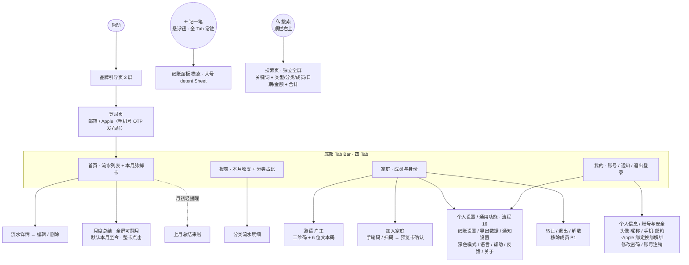

# 家账 · 信息架构与页面地图（IA）

> 文档版本：v0.2.6（新增「我的」Tab 设置项与通用功能规格 → PRD **流程 16**（§18）：三张设置卡「记账与数据 / 通用 / 帮助与关于」，含记账设置、导出数据、通知设置、深色模式、语言、帮助中心、意见反馈、关于家账；深色模式 / 语言为行内下拉菜单，用户协议 / 隐私政策为内置页 + 底部 Sheet；原列表「个人信息 / 账号与安全 / 绑定手机号」已并入流程 15 账号页、列表不再重复。历史：v0.2.5「我的」顶部用户块 → 个人信息 / 账号与安全页（流程 15）；v0.2.4 首页脉搏卡 + 月度总结全屏可翻月）
> 最后更新：2026-07-01
> 关联文档：PRD.md（流程 15 §17、流程 12 §14、流程 3/4/14、§3.5）、MVP.md、DATAMODEL.md、DESIGN.md（§5.2、§5.6）
> 负责人：产品组 / 设计

---

## 1. 设计基线

- **目标平台**：iOS App。
- **设计规范**：全部 UI 以 **iOS 26 设计规范（HIG）** 为准，包括导航、组件、间距、字体、动效与配色。
- 本文档只定义信息架构与页面骨架，**不约束具体视觉**；后续可由 PRD.md + MVP.md + 本文档驱动生成具体 UI 图。

---

## 2. 全局导航结构

参照 iOS 26 标准底部 Tab Bar 规范（HIG），四 Tab + 悬浮主操作钮（详见 DESIGN §5.2）：

- **顶栏**：左上角为当前 Tab 名称标题；右上角为 **🔍 搜索图标**（点击进入搜索页）。**「我的」Tab 除外**——该页顶部为个人资料头，不放标题。
- **底部 Tab Bar**（标准四 Tab）：**首页 / 报表 / 家庭 / 我的**（SF Symbols 图标 + 文字标签）。
- **「➕ 记一笔」悬浮圆钮**：固定在 Tab Bar **右上方**（参照 iOS「提醒事项」新建钮），`accent/primary` 实底（近黑 / 近白，**非品牌橙**）+ `accent/onPrimary` ➕；**四 Tab 下常驻、语义统一为打开记账面板**，不随 Tab 变化。
- **今日格言**：v0.5.0 已整体移除（不再在底部，也不在记账面板展示；DESIGN §5.3）。

```
┌─────────────────────────────┐
│  首页                [ 🔍 ] │  ← 顶栏（左上 Tab 名 + 右上搜索图标）
│                             │
│         （页面内容）         │
│                       ( ➕ ) │  ← 记一笔 悬浮圆钮（Tab Bar 右上方）
├─────────────────────────────┤
│  🏠首页  📊报表  👨‍👩‍👧家庭  👤我的 │  ← 标准四 Tab
└─────────────────────────────┘
```

| 区域           | 元素                               | 作用                                                                 |
| -------------- | ---------------------------------- | -------------------------------------------------------------------- |
| 顶栏左上       | 当前 Tab 名标题（「我的」除外）    | 页面标识                                                             |
| 顶栏右上       | 🔍 搜索图标                        | 进入搜索页（独立全屏；关键词 + 类型/分类/成员/日期/金额区间 + 合计） |
| 底部 Tab Bar   | 首页 / 报表 / 家庭 / 我的（4 Tab） | 主导航                                                               |
| Tab Bar 右上方 | ➕ 记一笔 悬浮圆钮                 | 记一笔（主操作），全 Tab 常驻                                        |

---

## 3. 页面地图（MVP P0 范围）



---

## 4. 各位置内容速览

> 状态截至 2026-06-20：✅ 已实现 / 🟡 部分实现。

| 位置              | 页面                                                                                                                                                 | 对应流程             | MVP / 状态                                 |
| ----------------- | ---------------------------------------------------------------------------------------------------------------------------------------------------- | -------------------- | ------------------------------------------ |
| 顶栏右上 🔍       | 搜索页（独立全屏；关键词 + 类型/分类/成员/日期/金额区间 + 结果合计，详见 PRD 流程 14）                                                               | —                    | P0 ✅                                      |
| Tab Bar 右上方 ➕ | 记账面板（模态弹出，大号 detent Sheet）                                                                                                              | 流程 2               | P0 ✅                                      |
| Tab 首页          | 流水列表 + 本月脉搏卡（预算口径 · 锁本月 · 内联超支预警态 · 现金流结余行）+ 月度总结全屏入口（hero 整卡点击，默认本月至今）+ 流水详情 / 编辑 / 删除 | 流程 2 / 10 / 8 / 9  | P0 ✅（脉搏卡重构 2026-06-27）             |
| Tab 报表          | 周/月/年切换 + 收支结余（含环比）+ 结余率仪表 + 分类占比环形图 + 分类环比 + 成员贡献 + 消费趋势 + 累计同期双线 + 大额 Top5 + 收入结构（月度总结入口已上移首页，报表内不再设）          | 流程 9               | P0 ✅ + P1 ✅（高级图表已补齐 2026-06-21） |
| Tab 家庭          | 成员列表、邀请（二维码 + 6 位文本码）、加入家庭（手输码 / 扫码 → 家庭预览卡确认）、家庭设置（户主改家庭名 / 封面）、转让 / 退出 / 解散、户主移除成员、**快捷功能**（预算 / 储蓄目标 / 邀请家人 / 家庭通知 / 分类管理，均 Modal Sheet 弹窗） | 流程 3/4/5/6/7/8/11/13   | P0 ✅ + 流程 6 ✅                          |
| Tab 我的          | 顶部用户信息块 → **个人信息 / 账号与安全**页（头像 / 昵称、手机 / 邮箱 / Apple 绑定 / 换绑 / 解绑、修改密码、账号注销；PRD 流程 15）；三张设置卡——**记账与数据**（记账设置 / 导出数据）、**通用**（通知设置 / 深色模式 / 语言）、**帮助与关于**（帮助中心 / 意见反馈 / 关于家账），规格见 PRD 流程 16；**退出登录**独立留页底 | 流程 15 / 16 / 12    | 账号页待实现；设置项已定义（流程 16），待开发   |
| 全局              | App 内通知条幅 / 被移除全屏提示 + 通知中心                                                                                                           | 流程 13              | P0 ✅；系统推送移至发布前（MVP §2.4）      |

---

## 5. 说明与待定

- 底部已定为标准四 Tab（首页 / 报表 / 家庭 / 我的），**不再扩 Tab**；预算、储蓄目标、家庭通知、分类管理均落地为「家庭」Tab「快捷功能」区的 Modal Sheet 入口（分类管理 2026-06-22 接入，复用现成 `CategoryManageSheet`）。「我的」Tab 承载账号信息（头块 → 流程 15 账号页）+ 设置项（三张卡，规格见 PRD 流程 16）+ 退出登录（页底独立）。
- 「我的」Tab 顶部用户信息块点击进入**个人信息 / 账号与安全**页（PRD 流程 15，§17），统一承载头像 / 昵称、手机号 / 邮箱 / Apple 的绑定 / 换绑 / 解绑、修改密码与账号注销；原列表里重复的「个人信息 / 账号与安全 / 绑定手机号」入口合并至此。两条安全底线：**账号至少保留一种登录方式**、**敏感操作先身份校验**。**退出登录**不进该页，保持在「我的」页**底部**独立按钮（登出 ≠ 销号）。账号注销规则见 PRD 流程 12（§14），已由远期落地为该页真实入口。
- 「我的」列表按三张卡分组（**记账与数据 / 通用 / 帮助与关于**），承接原占位入口的实功能，规格见 PRD 流程 16（§18）：深色模式 / 语言用**行内下拉菜单**即时切换（语言暂 Toast 兜底，等 i18n），记账设置 / 导出数据 / 通知设置 / 帮助 / 反馈 / 关于走**子页**，用户协议 / 隐私政策为**内置页 + 底部 Sheet**（合规必备，不外链）。个人级偏好只影响本人；账期 / 币种等家庭级设置不入本页。
- 搜索页为**独立全屏页（push，非 Sheet / 抽屉）**；关键词 + 类型 / 分类 / 成员 / 日期 / 金额区间多维筛选 + 结果合计条 + 搜索历史为该页职责，规格见 PRD 流程 14。搜索负责「多维自由组合 + 关键词」的明细检索，与报表「单维下钻」的聚合洞察分工。
- 「加入家庭」入口（默认手输 6 位邀请码，可「改用扫码」）建议同时放在「家庭页」和「我的页」；手输与扫码收敛到同一张家庭预览卡确认（PRD 流程 4）。
- 家庭名 / 封面的设置分两处：新用户引导的可选「完善家庭」步骤（PRD §3.5）与「家庭」Tab 的**家庭设置**页（仅户主可改）。
- 首页超支预警内联进 hero「本月脉搏卡」的 warning/danger 态，**不再用独立顶部红条**（消除「红条说超支、概览卡说结余为正」的口径打架）；首页 InsightBanner 仍为纯展示的「本月家庭动态」（不再跳转）。
- 月度总结的**唯一醒目入口为首页 hero 卡整卡点击**（全屏、默认本月至今、可翻月看历史），**报表 Tab 内不再设月度总结入口**（撤回报表底部 sheet）；每月初前 7 天首页加「上月总结来啦」轻提醒，点击深链定位上月已结算实例（2026-06-27 调整，承接 2026-06-20「聚合 / 对比类内容归报表、首页只做当下状态与行动」的同一原则）。
