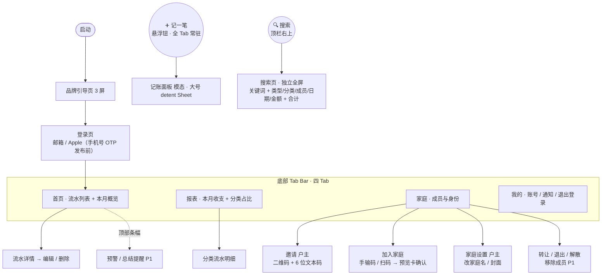

# 家账 · 信息架构与页面地图（IA）

> 文档版本：v0.2.3（家庭页加入入口细化：邀请＝二维码 + 6 位文本码；加入＝手输码 / 扫码统一确认页（家庭预览卡）；家庭页新增「家庭设置」（户主改家庭名 / 封面），对应 PRD 流程 3/4、§3.5）
> 最后更新：2026-06-21
> 关联文档：PRD.md（§17；流程 3/4/14、§3.5）、MVP.md、DATAMODEL.md、DESIGN.md（§5.2、§5.6）
> 负责人：产品组 / 设计

---

## 1. 设计基线

- **目标平台**：iOS App。
- **设计规范**：全部 UI 以 **iOS 26 设计规范（HIG）** 为准，包括导航、组件、间距、字体、动效与配色。
- 本文档只定义信息架构与页面骨架，**不约束具体视觉**；后续可由 PRD.md + MVP.md + 本文档驱动生成具体 UI 图。

---

## 2. 全局导航结构

参照 iOS 26 标准底部 Tab Bar 规范（HIG），四 Tab + 悬浮主操作钮（详见 DESIGN §5.2）：

- **顶栏**：左上角为当前 Tab 名称标题；右上角为 **🔍 搜索图标**（点击进入搜索页）。**「我的」Tab 除外**——该页顶部为个人资料头，不放标题。
- **底部 Tab Bar**（标准四 Tab）：**首页 / 报表 / 家庭 / 我的**（SF Symbols 图标 + 文字标签）。
- **「➕ 记一笔」悬浮圆钮**：固定在 Tab Bar **右上方**（参照 iOS「提醒事项」新建钮），强调色实底 + 白色 ➕；**四 Tab 下常驻、语义统一为打开记账面板**，不随 Tab 变化。
- **今日格言**：不再在底部展示，移入记账面板顶部（DESIGN §5.3）。

```
┌─────────────────────────────┐
│  首页                [ 🔍 ] │  ← 顶栏（左上 Tab 名 + 右上搜索图标）
│                             │
│         （页面内容）         │
│                       ( ➕ ) │  ← 记一笔 悬浮圆钮（Tab Bar 右上方）
├─────────────────────────────┤
│  🏠首页  📊报表  👨‍👩‍👧家庭  👤我的 │  ← 标准四 Tab
└─────────────────────────────┘
```

| 区域           | 元素                               | 作用                                                                 |
| -------------- | ---------------------------------- | -------------------------------------------------------------------- |
| 顶栏左上       | 当前 Tab 名标题（「我的」除外）    | 页面标识                                                             |
| 顶栏右上       | 🔍 搜索图标                        | 进入搜索页（独立全屏；关键词 + 类型/分类/成员/日期/金额区间 + 合计） |
| 底部 Tab Bar   | 首页 / 报表 / 家庭 / 我的（4 Tab） | 主导航                                                               |
| Tab Bar 右上方 | ➕ 记一笔 悬浮圆钮                 | 记一笔（主操作），全 Tab 常驻                                        |

---

## 3. 页面地图（MVP P0 范围）



---

## 4. 各位置内容速览

> 状态截至 2026-06-20：✅ 已实现 / 🟡 部分实现。

| 位置              | 页面                                                                                                                                                 | 对应流程             | MVP / 状态                                 |
| ----------------- | ---------------------------------------------------------------------------------------------------------------------------------------------------- | -------------------- | ------------------------------------------ |
| 顶栏右上 🔍       | 搜索页（独立全屏；关键词 + 类型/分类/成员/日期/金额区间 + 结果合计，详见 PRD 流程 14）                                                               | —                    | P0 ✅                                      |
| Tab Bar 右上方 ➕ | 记账面板（模态弹出，大号 detent Sheet）                                                                                                              | 流程 2               | P0 ✅                                      |
| Tab 首页          | 流水列表 + 本月概览卡 + 预算预警条幅 + 月度总结入口 + 流水详情 / 编辑 / 删除                                                                         | 流程 2 / 10 / 8 / 9  | P0 ✅（含 P1 条幅）                        |
| Tab 报表          | 周/月/年切换 + 收支结余 + 结余率仪表 + 分类占比环形图 + 分类环比 + 成员贡献 + 消费趋势 + 累计同期双线 + 大额 Top5 + 收入结构 + 月度总结入口          | 流程 9               | P0 ✅ + P1 ✅（高级图表已补齐 2026-06-21） |
| Tab 家庭          | 成员列表、邀请（二维码 + 6 位文本码）、加入家庭（手输码 / 扫码 → 家庭预览卡确认）、家庭设置（户主改家庭名 / 封面）、转让 / 退出 / 解散、户主移除成员、**快捷功能**（预算 / 储蓄目标 / 邀请家人 / 家庭通知 / 分类管理，均 Modal Sheet 弹窗） | 流程 3/4/5/6/7/8/11/13   | P0 ✅ + 流程 6 ✅                          |
| Tab 我的          | 账号信息、设置项（通知 / 语言 / 深色模式 / 记账设置 / 导出数据等，当前多为占位）、退出登录（注销远期）                                                 | —                    | P0 ✅（设置项多为占位）                         |
| 全局              | App 内通知条幅 / 被移除全屏提示 + 通知中心                                                                                                           | 流程 13              | P0 ✅；系统推送移至发布前（MVP §2.4）      |

---

## 5. 说明与待定

- 底部已定为标准四 Tab（首页 / 报表 / 家庭 / 我的），**不再扩 Tab**；预算、储蓄目标、家庭通知、分类管理均落地为「家庭」Tab「快捷功能」区的 Modal Sheet 入口（分类管理 2026-06-22 接入，复用现成 `CategoryManageSheet`）。「我的」Tab 仅承载账号信息 + 设置项（多为占位）+ 退出登录。
- 搜索页为**独立全屏页（push，非 Sheet / 抽屉）**；关键词 + 类型 / 分类 / 成员 / 日期 / 金额区间多维筛选 + 结果合计条 + 搜索历史为该页职责，规格见 PRD 流程 14。搜索负责「多维自由组合 + 关键词」的明细检索，与报表「单维下钻」的聚合洞察分工。
- 「加入家庭」入口（默认手输 6 位邀请码，可「改用扫码」）建议同时放在「家庭页」和「我的页」；手输与扫码收敛到同一张家庭预览卡确认（PRD 流程 4）。
- 家庭名 / 封面的设置分两处：新用户引导的可选「完善家庭」步骤（PRD §3.5）与「家庭」Tab 的**家庭设置**页（仅户主可改）。
- 顶部条幅：预算预警（80%/超支）已在首页实现；首页 InsightBanner 改为纯展示的「本月家庭动态」（不再跳转），月度总结卡统一从「报表」Tab 的「查看月度总结」进入（2026-06-20 调整，避免与报表入口重复）。
