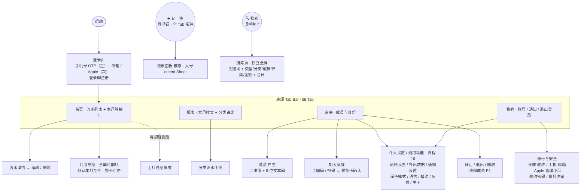

# 家账 · 信息架构与页面地图（IA）

> 文档版本：v0.2.9（**G1/G2 原型评审定稿**：账号页定名「账号与安全」，登录方式行改**整行 push 进各自管理小页**（G4-G6 随之改为小页形态）；FAB 颜色描述同步 DESIGN v0.6.0 系统蓝。历史：v0.2.8 **新增 §6 逐屏骨架清单（Screen Catalog）**：按最新 PRD 逐屏定义类型 / 区块 / 关键态 / 操作，覆盖全局·登录·首页·报表·搜索·家庭·我的共约 48 屏（多视图容器已拆为子屏、含未开发屏），用于驱动原型 / 线框图生成；v0.2.7 跟随 PRD v0.1.9 砍掉「首次启动引导」、页面地图去掉品牌引导页、登录方式同步为手机 OTP（主）+ 邮箱 / Apple（次）、家庭名 / 封面仅在「家庭设置」页设置。更早：v0.2.6 新增「我的」Tab 设置项与通用功能规格（PRD 流程 16 §18）；v0.2.5「我的」顶部用户块 → 个人信息 / 账号与安全页（流程 15）；v0.2.4 首页脉搏卡 + 月度总结全屏可翻月）
> 最后更新：2026-07-01
> 关联文档：PRD.md（流程 15 §17、流程 12 §14、流程 3/4/14、§3.5）、MVP.md、DATAMODEL.md、DESIGN.md（§5.2、§5.6）
> 负责人：产品组 / 设计

---

## 1. 设计基线

- **目标平台**：iOS App。
- **设计规范**：全部 UI 以 **iOS 26 设计规范（HIG）** 为准，包括导航、组件、间距、字体、动效与配色。
- 本文档只定义信息架构与页面骨架，**不约束具体视觉**；后续可由 PRD.md + MVP.md + 本文档驱动生成具体 UI 图。

---

## 2. 全局导航结构

参照 iOS 26 标准底部 Tab Bar 规范（HIG），四 Tab + 悬浮主操作钮（详见 DESIGN §5.2）：

- **顶栏**：左上角为当前 Tab 名称标题；右上角为 **🔍 搜索图标**（点击进入搜索页）。**「我的」Tab 除外**——该页顶部为个人资料头，不放标题。
- **底部 Tab Bar**（标准四 Tab）：**首页 / 报表 / 家庭 / 我的**（SF Symbols 图标 + 文字标签）。
- **「➕ 记一笔」悬浮圆钮**：固定在 Tab Bar **右上方**（参照 iOS「提醒事项」新建钮），`accent/primary` 实底（**系统蓝**，随 DESIGN v0.6.0 交互色统一为蓝；非品牌橙）+ `accent/onPrimary` 白色 ➕；**四 Tab 下常驻、语义统一为打开记账面板**，不随 Tab 变化。
- **今日格言**：v0.5.0 已整体移除（不再在底部，也不在记账面板展示；DESIGN §5.3）。

```
┌─────────────────────────────┐
│  首页                [ 🔍 ] │  ← 顶栏（左上 Tab 名 + 右上搜索图标）
│                             │
│         （页面内容）         │
│                       ( ➕ ) │  ← 记一笔 悬浮圆钮（Tab Bar 右上方）
├─────────────────────────────┤
│  🏠首页  📊报表  👨‍👩‍👧家庭  👤我的 │  ← 标准四 Tab
└─────────────────────────────┘
```

| 区域           | 元素                               | 作用                                                                 |
| -------------- | ---------------------------------- | -------------------------------------------------------------------- |
| 顶栏左上       | 当前 Tab 名标题（「我的」除外）    | 页面标识                                                             |
| 顶栏右上       | 🔍 搜索图标                        | 进入搜索页（独立全屏；关键词 + 类型/分类/成员/日期/金额区间 + 合计） |
| 底部 Tab Bar   | 首页 / 报表 / 家庭 / 我的（4 Tab） | 主导航                                                               |
| Tab Bar 右上方 | ➕ 记一笔 悬浮圆钮                 | 记一笔（主操作），全 Tab 常驻                                        |

---

## 3. 页面地图（MVP P0 范围）



---

## 4. 各位置内容速览

> 本节为 **Tab 级** 概览；**屏 / 视图级**的逐屏骨架（区块 / 关键态 / 操作，约 48 屏）见 **§6 逐屏骨架清单**。
>
> 状态截至 2026-06-20：✅ 已实现 / 🟡 部分实现。

| 位置              | 页面                                                                                                                                                 | 对应流程             | MVP / 状态                                 |
| ----------------- | ---------------------------------------------------------------------------------------------------------------------------------------------------- | -------------------- | ------------------------------------------ |
| 顶栏右上 🔍       | 搜索页（独立全屏；关键词 + 类型/分类/成员/日期/金额区间 + 结果合计，详见 PRD 流程 14）                                                               | —                    | P0 ✅                                      |
| Tab Bar 右上方 ➕ | 记账面板（模态弹出，大号 detent Sheet）                                                                                                              | 流程 2               | P0 ✅                                      |
| Tab 首页          | 流水列表 + 本月脉搏卡（预算口径 · 锁本月 · 内联超支预警态 · 现金流结余行）+ 月度总结全屏入口（hero 整卡点击，默认本月至今）+ 流水详情 / 编辑 / 删除 | 流程 2 / 10 / 8 / 9  | P0 ✅（脉搏卡重构 2026-06-27）             |
| Tab 报表          | 周/月/年切换 + 收支结余（含环比）+ 结余率仪表 + 分类占比环形图 + 分类环比 + 成员贡献 + 消费趋势 + 累计同期双线 + 大额 Top5 + 收入结构（月度总结入口已上移首页，报表内不再设）          | 流程 9               | P0 ✅ + P1 ✅（高级图表已补齐 2026-06-21） |
| Tab 家庭          | 成员列表、邀请（二维码 + 6 位文本码）、加入家庭（手输码 / 扫码 → 家庭预览卡确认）、家庭设置（户主改家庭名 / 封面）、转让 / 退出 / 解散、户主移除成员、**快捷功能**（预算 / 储蓄目标 / 邀请家人 / 家庭通知 / 分类管理，均 Modal Sheet 弹窗） | 流程 3/4/5/6/7/8/11/13   | P0 ✅ + 流程 6 ✅                          |
| Tab 我的          | 顶部用户信息块 → **账号与安全**页（头像 / 昵称、手机 / 邮箱 / Apple 各自的**管理小页**（绑定 / 换绑 / 解绑）、修改密码、账号注销；PRD 流程 15）；三张设置卡——**记账与数据**（记账设置 / 导出数据）、**通用**（通知设置 / 深色模式 / 语言）、**帮助与关于**（帮助中心 / 意见反馈 / 关于家账），规格见 PRD 流程 16；**退出登录**独立留页底 | 流程 15 / 16 / 12    | 账号页待实现；设置项已定义（流程 16），待开发   |
| 全局              | App 内通知条幅 / 被移除全屏提示 + 通知中心                                                                                                           | 流程 13              | P0 ✅；系统推送移至发布前（MVP §2.4）      |

---

## 5. 说明与待定

- 底部已定为标准四 Tab（首页 / 报表 / 家庭 / 我的），**不再扩 Tab**；预算、储蓄目标、家庭通知、分类管理均落地为「家庭」Tab「快捷功能」区的 Modal Sheet 入口（分类管理 2026-06-22 接入，复用现成 `CategoryManageSheet`）。「我的」Tab 承载账号信息（头块 → 流程 15 账号页）+ 设置项（三张卡，规格见 PRD 流程 16）+ 退出登录（页底独立）。
- 「我的」Tab 顶部用户信息块点击进入**账号与安全**页（PRD 流程 15，§17；2026-07-01 定名），统一承载头像 / 昵称、手机号 / 邮箱 / Apple 的绑定 / 换绑 / 解绑（**登录方式行整行 push 进各自「管理小页」，操作在小页内**）、修改密码与账号注销；原列表里重复的「个人信息 / 账号与安全 / 绑定手机号」入口合并至此。两条安全底线：**账号至少保留一种登录方式**、**敏感操作先身份校验**。**退出登录**不进该页，保持在「我的」页**底部**独立按钮（登出 ≠ 销号）。账号注销规则见 PRD 流程 12（§14），已由远期落地为该页真实入口。
- 「我的」列表按三张卡分组（**记账与数据 / 通用 / 帮助与关于**），承接原占位入口的实功能，规格见 PRD 流程 16（§18）：深色模式 / 语言用**行内下拉菜单**即时切换（语言暂 Toast 兜底，等 i18n），记账设置 / 导出数据 / 通知设置 / 帮助 / 反馈 / 关于走**子页**，用户协议 / 隐私政策为**内置页 + 底部 Sheet**（合规必备，不外链）。个人级偏好只影响本人；账期 / 币种等家庭级设置不入本页。
- 搜索页为**独立全屏页（push，非 Sheet / 抽屉）**；关键词 + 类型 / 分类 / 成员 / 日期 / 金额区间多维筛选 + 结果合计条 + 搜索历史为该页职责，规格见 PRD 流程 14。搜索负责「多维自由组合 + 关键词」的明细检索，与报表「单维下钻」的聚合洞察分工。
- 「加入家庭」入口（默认手输 6 位邀请码，可「改用扫码」）建议同时放在「家庭页」和「我的页」；手输与扫码收敛到同一张家庭预览卡确认（PRD 流程 4）。
- 家庭名 / 封面统一在「家庭」Tab 的**家庭设置**页设置（仅户主可改，PRD §3.5）；新用户「完善家庭」引导步骤已废，注册自动建单人家庭后用默认名 + 默认占位封面。
- 首页超支预警内联进 hero「本月脉搏卡」的 warning/danger 态，**不再用独立顶部红条**（消除「红条说超支、概览卡说结余为正」的口径打架）；首页 InsightBanner 仍为纯展示的「本月家庭动态」（不再跳转）。
- 月度总结的**唯一醒目入口为首页 hero 卡整卡点击**（全屏、默认本月至今、可翻月看历史），**报表 Tab 内不再设月度总结入口**（撤回报表底部 sheet）；每月初前 7 天首页加「上月总结来啦」轻提醒，点击深链定位上月已结算实例（2026-06-27 调整，承接 2026-06-20「聚合 / 对比类内容归报表、首页只做当下状态与行动」的同一原则）。

---

## 6. 逐屏骨架清单（Screen Catalog）

> 用途：驱动 AI 生成页面原型 / 线框图。每屏一小节，格式固定：**类型（入口）→ 目的 → 区块（上→下）→ 关键态 → 操作 → 关联**。区块顺序即版面从上到下的骨架次序；关键态为需另出线框的空 / 加载 / 错误 / 权限变体。视觉令牌与组件外观见 DESIGN.md，交互规则与字段见 PRD.md。
>
> 状态：✅ 已实现 · 🟡 部分 / 占位 · ⬜ 未开发。类型缩写：**Tab** 主页 / **Push** 全屏子页 / **Sheet** 底部升起 / **Modal** 居中弹窗 / **Overlay** 覆盖层 / **Inline** 行内展开。多视图容器已按子屏拆分。

### 6.A 全局 / 框架

**A1 · App 框架** — 框架 · ✅
- 目的：四 Tab + 主操作 + 搜索的稳定外壳（详见 §2）。
- 区块：顶栏（左＝Tab 名 / 右＝🔍，「我的」除外）→ 页面内容 → ➕记一笔 FAB（Tab Bar 右上方，全 Tab 常驻）→ 底部 Tab Bar（首页 / 报表 / 家庭 / 我的）。
- 关键态：各 Tab 选中态；FAB 语义恒为打开记账面板。
- 关联：PRD 流程 2；DESIGN §9.1 / §9.2 / §10.1。

**A2 · 启动 Splash** — Overlay · ✅
- 目的：冷启动品牌动画过场，session 就绪后卸载。
- 区块：居中 Logo 动画 + 中性底。
- 关键态：加载中 → 淡出。
- 关联：DESIGN 品牌资产。

**A3 · 关键通知全屏提示** — Overlay（事件触发）· ✅
- 目的：被移除 / 解散 / 转让等状态变更的 App 内强兜底，不依赖系统推送。
- 区块：图标 → 标题（「你已不在该家庭」/「家庭已解散」）→ 说明文案 → 确认按钮。
- 关键态：被移除 / 被解散 / 户主变更；确认后落到新单人家庭。
- 关联：PRD 流程 13（§15）。

**A4 · App 内通知条幅 / 红点** — Overlay · 🟡
- 目的：非阻断事件的轻提示与未读标记。
- 区块：顶部条幅（可点进通知中心）；家庭通知入口红点。
- 关键态：有 / 无未读。
- 关联：PRD 流程 13。

### 6.B 登录（流程 1）

**B1 · 登录页** — 全屏（未登录覆盖）· ✅
- 目的：手机 OTP（主）/ 邮箱 / Apple 登录，登录即注册、无独立注册页。
- 区块（上→下）：品牌头（Logo + 名，无插画）→ 主输入区（手机号 +「获取验证码」→ 验证码框 ｜ 邮箱 + 密码）→ 切换登录方式链接 → Apple 登录按钮 → 底部协议勾选行《用户协议》《隐私政策》。
- 关键态：手机态 / 邮箱态 / 验证码已发送（倒计时）/ 短信通道异常（引导改邮箱·Apple）/ 登录失败。
- 操作：主＝获取验证码·登录；次＝切换方式、Apple、点协议链接（→ B2）。
- 关联：PRD §3、§3.6。

**B2 · 用户协议 / 隐私政策 Sheet** — Sheet · ⬜
- 目的：合规内置内容查看（不外链）。
- 区块：Sheet 顶栏（标题 + **右上角 X 关闭**）→ 可滚动正文（内置静态文本）。
- 关键态：协议 / 隐私两份内容切换；长文滚动。
- 操作：X 关闭 + 抓手下滑。与「关于家账」共用同一内容与组件。
- 关联：PRD §3.6 / §18.3.8；DESIGN §9.9。

### 6.C 首页 Tab（流程 2 / 8 / 9 / 10）

**C1 · 首页** — Tab · ✅
- 目的：一屏看懂「本月还能不能花」+ 最近流水，主操作即记账。
- 区块（上→下）：本月脉搏卡（hero · 预算口径 · 锁本月 · 现金流结余行 · 超支内联 warning/danger 态 · 整卡点击进月度总结）→〔月初前 7 天〕「上月总结来啦」轻提醒条 →「本月家庭动态」纯展示条 → 流水列表（按日分组，日期头带当日小计）。
- 关键态：无记账空态（引导去记一笔）/ 加载骨架（C2）/ 未设预算（脉搏卡降级为现金流摘要 +「设置预算」引导，户主可点）/ 超支 danger 态。
- 操作：主＝➕记账；次＝点脉搏卡进总结、点流水进详情、🔍。
- 关联：PRD §4 / §10 / §11；DESIGN §10.2。

**C2 · 首页加载骨架 / 空态** — 态 · ✅
- 目的：数据未就绪 / 无数据的占位。
- 区块：骨架＝脉搏卡骨架 + 数行流水骨架；空态＝插画 / 文案 +「记一笔」CTA。
- 关联：DESIGN §9.10。

**C3 · 记账面板** — Sheet（大 detent · 自定义键盘）· ✅
- 目的：最少步骤记一笔，金额唯一必填。
- 区块（上→下）：抓手 → 类型分段（支出 / 收入，默认支出）→ 金额大字显示区 → 分类横向选择 → 备注 → 时间 → 记账人（**仅多人家庭显**）→ 自定义数字键盘 → 保存按钮。
- 关键态：金额=0 保存禁用 / 保存中 / 网络异常（本地缓存提示，MVP 纯在线则提示重试）/ 服务器异常（数据保留）。
- 操作：主＝保存；次＝切类型、选分类 / 时间 / 记账人。首次记账成功 → C4。
- 关联：PRD §4；DESIGN §10.3。

**C4 · 首次记账庆祝** — Modal · ✅
- 目的：家庭第一笔成功后的情感反馈。
- 区块：半透明遮罩 → 居中卡（🎉 + 文案 +「好的」）。
- 关键态：仅首笔触发一次。
- 关联：PRD §4.3。

**C5 · 流水详情 → 编辑 / 删除** — Sheet · ✅
- 目的：查看单笔并按权限修正 / 删除，构成记账闭环。
- 区块：详情区（金额 / 类型 / 分类 / 备注 / 时间 / 记账人）→〔有权限〕编辑 / 删除操作。
- 关键态：本人 / 户主（可编辑删除）vs 其他成员（只读）/ 储蓄类流水（本页不可编辑删除，引导去目标）/ 已被他人删除（提示并刷新）；编辑金额=0 禁用保存；删除二次确认（普通弹窗）。
- 操作：主＝保存修改 / 确认删除；次＝取消。
- 关联：PRD §12（流程 10）；DESIGN §9.11。

**C6 · 月度总结** — Push 全屏（首页 hero 整卡点击）· ✅（存图待补）
- 目的：家庭仪式感总结，可随时看本月、翻月回看。
- 区块（上→下）：顶栏（返回 + 左右翻月）→ 标题（「2026 年 6 月 · 截至今日」/「2026 年 5 月」）→ 总支出 / 总收入 / 结余 → 最大单笔 → 支出最高分类 → 记账最积极的人 → 对比上月 → 暖心一句 →〔已结算月〕保存图片按钮。
- 关键态：本月至今（进行中 · 实时 · 无存图 · 进行中口吻）/ 已结算月（全字段 + 暖心文案 + 存图）/ 该月无记账（「暂无总结」占位）。
- 操作：主＝翻月；次＝保存图片（仅已结算月）、返回。
- 关联：PRD §11.5.2；DESIGN §10.2 联动。

### 6.D 报表 Tab（流程 9）

**D1 · 报表中心** — Tab · ✅
- 目的：把流水转成结构与趋势洞察。
- 区块（上→下）：时间维度分段（周 / 月 / 年，默认月）+ 周期左右滑动 → 本期概览（收入 / 支出 / 结余，含环比）→ 结余率仪表 → 支出分类占比环形 + 明细 → 分类环比 → 成员贡献（笔数）→ 消费趋势折线 → 累计同期对比双线 → 大额支出 Top 5 → 收入结构。
- 关键态：空态（D4）/ 某周期无数据（占位）/ 加载 / 加载失败（留缓存）。
- 操作：主＝切维度 / 周期；次＝点分类下钻（D2）、点成员下钻（D3）。
- 关联：PRD §11.5.1；DESIGN §10.8。

**D2 · 分类流水明细（下钻）** — Push / 态 · ✅
- 目的：某分类在当期的流水清单（消费口径）。
- 区块：分类头（名 + 合计）→ 按日分组流水列表。
- 关键态：空 / 加载。
- 关联：PRD §11.5.1 下钻规则。

**D3 · 成员记账明细（下钻）** — Push / 态 · ⬜（PRD 有 · 代码无）
- 目的：某成员的记账明细（参与度视角，不排名金额）。
- 区块：成员头（昵称 + 笔数）→ 该成员流水列表。
- 关键态：空 / 加载 / 已退出成员（保留条目）。
- 关联：PRD §11.5.1 下钻规则。

**D4 · 报表空态** — 态 · ✅
- 区块：插画 / 文案 +「去记一笔」。
- 关联：DESIGN §9.10。

### 6.E 搜索（流程 14）

**E1 · 搜索页** — Push 全屏 · ✅
- 目的：关键词 + 多维筛选定位流水与临时对账。
- 区块（上→下）：顶栏（返回 / 取消 + 关键词输入）→ 筛选区（类型 / 分类多选 / 成员多选 / 日期范围 / 金额区间）→ 结果合计条（笔数 / 支出 / 收入 / 净额，常驻）→ 按日分组结果列表。
- 关键态：初始（展示搜索历史，可回填 / 单删 / 清空）/ 无结果（提示换词·放宽）/ 金额区间或日期非法（即时校验）/ 命中已被删除（提示并刷新）。
- 操作：主＝检索（维度间 AND）；次＝点结果进详情（复用 C5）、清历史。
- 关联：PRD §16；DESIGN §10.7。

### 6.F 家庭 Tab（流程 3-8 / 11 / 13）

**F1 · 家庭主页** — Tab · ✅
- 目的：家庭身份、成员概览与全部家庭能力入口。
- 区块（上→下）：家庭头（封面 + 家庭名）→ 我的身份（户主 / 成员）→ 成员统计区 → 快捷功能区（预算 / 储蓄目标 / 邀请家人 / 家庭通知 / 分类管理）→〔户主〕家庭管理（→ 成员管理 F5 / 家庭设置 F4）→〔成员〕退出家庭。
- 关键态：单人家庭（引导邀请）vs 多人家庭 / 户主 vs 成员（入口差异）/ 加载。
- 操作：主＝各快捷功能；次＝家庭管理 / 退出。
- 关联：PRD 流程 3-8；DESIGN §10.6。

**F2 · 邀请家人** — Sheet · ✅
- 目的：户主生成一条邀请（文本码 + 同源二维码）。
- 区块（上→下）：家庭名 + 户主信息 → 6 位文本码（3+3 分段）+ 一键复制 → 二维码 → 有效期倒计时 → 保存图片 / 刷新。
- 关键态：生成中 / 生成失败（重试）/ 已复制短暂态 / 家庭人数已满（阻断提示）/ 过期（提示刷新）。
- 操作：主＝复制 / 保存二维码；次＝刷新（作废旧的）。
- 关联：PRD §5（流程 3）。

**F3 · 加入家庭** — Sheet · ✅
- 目的：手输 / 扫码 → 预览确认 → 加入。
- 区块（上→下）：输入区（6 段码框 ｜「改用扫码」）→ 家庭预览卡（封面 / 名 / 户主昵称头像 / 成员头像堆叠 + X·8 人）→ 加入影响提示条 → 加入按钮。
- 关键态：输入态 / 拉取中 / 4 种影响态（none 直接加入 · delete_origin ⚠删原家庭 · auto_leave ⚠自动退出 · blocked_owner ⛔禁用并引导转让·解散）/ 校验失败（过期 / 作废 / 已满 / 已在该家庭 / 非本 App 码）/ 破坏性二次确认。
- 操作：主＝加入「家庭名」；次＝改用扫码。
- 关联：PRD §6（流程 4）。

**F4 · 家庭设置** — Sheet · ✅
- 目的：户主改家庭名 / 封面。
- 区块：家庭名编辑 → 封面（预设图库 + 自定义上传）。
- 关键态：户主可改 vs 成员只读 / 上传中 / 上传失败。
- 关联：PRD §3.5。

**F5 · 成员管理** — Sheet · ✅
- 目的：名册与成员操作。
- 区块（上→下）：成员计数 + 邀请入口 → 成员名册（头像 / 昵称 / 加入时间）→ 点成员弹菜单（查看资料 / 转让户主给 TA / 移除成员）。
- 关键态：户主（可转让 / 移除）vs 成员（只读）/ 唯一成员（转让不可用）。
- 操作：转让 / 移除 → F6。
- 关联：PRD 流程 5 / 6。

**F6 · 危险确认（转让 / 移除 / 解散）** — Sheet / Modal · ✅
- 目的：破坏性操作的强确认闸门。
- 区块（上→下）：警示文案 → 文字匹配输入闸门（转让 / 移除＝对方手机号后 4 位；解散＝输入家庭名）→ 滑动以确认。
- 关键态：闸门不匹配（禁用）/ 处理中 / 失败重试 / 转让成功追问「是否顺便退出」。
- 关联：PRD §7.4 / §8.4（注：代码现用「对方昵称」，PRD 为「手机号后 4 位」，待统一）。

**F7 · 预算** — Sheet · ✅
- 目的：户主设总 / 分类预算，全家看执行。
- 区块（上→下）：〔执行态〕总预算 / 已用 / 剩余 + 距月底天数 + 分类执行条 →〔设置态〕总预算输入 + 分类预算（可选，多条）+ 预警开关（默认 80%）。
- 关键态：未设（户主可设 / 成员提示「请户主设置」）/ 分类合计 > 总预算（仅警告）/ 某分类超支高亮 / 成员只读。
- 操作：主＝保存预算（仅户主）；次＝加分类。
- 关联：PRD §10（流程 8）。

**F8 · 储蓄目标 · 列表** — Sheet · ✅
- 目的：家庭攒钱目标总览。
- 区块：目标卡列表（封面 + 名 + 进度条 + 剩余天数）+「新建目标」。
- 关键态：空态（引导新建）/ 已达上限 5 个（新建阻断提示）。
- 操作：点目标 → F9；新建 → F10。
- 关联：PRD §9（流程 7）。

**F9 · 储蓄目标 · 详情** — 子屏 · ✅
- 区块（上→下）：进度条 + 已存 / 剩余 / 预计达成 → 存入 / 取出按钮 → 历史存取记录 →〔户主〕编辑 / 删除。
- 关键态：进行中 / 已达成（封顶 100%）/ 仅户主可删（成员隐藏删除）/ 删除二次确认（余额回吐为收入流水）。
- 操作：存入 / 取出 → F11；编辑 → F10。
- 关联：PRD §9.4。

**F10 · 储蓄目标 · 新建 / 编辑** — 子屏 · ✅
- 区块：目标名称 → 目标金额 → 截止日期 → 封面 → 备注。
- 关键态：必填（名称 + 金额）未满保存禁用 / 截止日早于今天（阻断）/ 编辑金额低于已存（允许，封顶不重复庆祝）。
- 关联：PRD §9.5。

**F11 · 储蓄目标 · 存入 / 取出** — 子屏 · ✅
- 区块：金额输入 → 备注 → 确认。
- 关键态：金额=0 禁用 / 取出 > 已存余额（阻断）/ 存入达 100% → 达成庆祝 F12 / 并发冲突重试。
- 关联：PRD §9.4（存入生成支出流水、取出生成收入流水）。

**F12 · 目标达成庆祝** — Modal · ✅
- 区块：庆祝卡（🎉 + 目标名 + 文案），全家可见。
- 关键态：仅首次达成触发一次。
- 关联：PRD §9.4。

**F13 · 分类管理** — Sheet · ✅
- 目的：维护家庭支出 / 收入分类。
- 区块（上→下）：支出 / 收入分段 → 分类列表（自定义可改 / 停用；系统分类只读 +〔户主〕隐藏开关）→ 新增分类（名称 + 图标）。
- 关键态：名称重复（提示）/ 仅户主可停用·隐藏（成员只读）/「其他支出·其他收入」兜底不可隐藏 / 停用后历史保留、分类预算失效。
- 关联：PRD §13（流程 11）。

**F14 · 家庭通知中心** — Sheet · ✅
- 区块：通知列表（被移除 / 转让 / 继任 / 目标达成 / 预算预警 / 月度总结）+ 已读态。
- 关键态：空态 / 有未读红点 / 点条目跳对应位置。
- 关联：PRD §15（流程 13）。

### 6.G 我的 Tab（流程 12 / 15 / 16）

**G1 · 我的主页** — Tab · 🟡占位
- 目的：账号入口 + 分组设置 + 退出。
- 区块（上→下）：用户信息块（头像 + 昵称 + 手机号行 → 点击进 G2）→ 卡一「记账与数据」（记账设置 / 导出数据）→ 卡二「通用」（通知设置 / 深色模式〔行内下拉〕/ 语言〔行内下拉〕）→ 卡三「帮助与关于」（帮助中心 / 意见反馈 / 关于家账）→ 页底退出登录。
- 关键态：已登录 / 头像上传中 / 深色·语言下拉展开态。
- 操作：主＝进各子页；次＝退出登录（二次确认）。
- 关联：PRD §18（流程 16）；DESIGN §10.5。

**G2 · 账号与安全页** — Push · ⬜
- 目的：个人资料 + 登录方式 + 密码 + 注销总览。页面标题「账号与安全」（2026-07-01 定名）。
- 区块（上→下）：个人资料（头像 / 昵称 → G3）→ 登录方式分组（手机 / 邮箱 / Apple 各一行，行尾**只显状态值 + chevron**，**整行 push 进该方式管理小页 G4-G6**，操作在小页内）→ 分组 footer（两条安全底线说明）→ 密码（修改 / 设置 → G7）→ 危险操作（账号注销 → G9，独立危险卡 + footer）。
- 关键态：各行已绑 vs 未绑（状态值文案差异）。
- 操作：进各管理小页 G4-G6、改密 G7、注销 G9。
- 关联：PRD §17（流程 15）；DESIGN §10.4。

**G3 · 头像 / 昵称编辑** — 态 / Sheet · 🟡（头像可换）
- 区块：头像（点击换图：选图 → 压缩 → 上传）→ 昵称编辑。
- 关键态：上传中 / 上传失败（昵称不受影响）。
- 关联：PRD §17.6。

**G4 · 手机号管理小页** — Push（自 G2 整行点击）· ⬜（底层 auth 已有）
- 区块：当前状态头（脱敏号 / 未绑定）→ 操作（未绑＝「绑定」；已绑＝「更换」，**无解绑**）→ 对应流程：绑定＝输入手机号 → OTP 验证 → 绑定；换绑＝旧号 OTP 校验身份 → 输入新号 → 新号 OTP → 完成。
- 关键态：OTP 倒计时 / 错误过期重发 / 新号被占用（阻断）。
- 关联：PRD §17.6。

**G5 · 邮箱管理小页** — Push（自 G2 整行点击）· ⬜
- 区块：当前状态头（脱敏邮箱 / 未绑定）→ 操作（未绑＝「绑定」；已绑＝「更换」「解绑」）→ 对应流程：绑定＝邮箱 + 设密码 → 验证 → 绑定；换绑＝身份校验 → 新邮箱验证 → 换；解绑＝校验「至少留一种」→ 身份校验 → 解绑。
- 关键态：邮箱被占用（阻断）/ 仅剩此一种登录方式时「解绑」置灰 + 提示。
- 关联：PRD §17.6。

**G6 · Apple 管理小页** — Push（自 G2 整行点击）· ⬜
- 区块：当前状态头（已连接 / 未连接）→ 操作（未绑＝「连接」；已绑＝「解绑」）→ 对应流程：绑定＝Apple 授权 → 合并到当前账号；解绑＝校验「至少留一种」→ 身份校验 → 解绑。
- 关键态：仅剩此一种登录方式时「解绑」置灰 + 提示。
- 关联：PRD §17.6。

**G7 · 修改 / 设置密码** — 子流程 · ⬜
- 区块：已设＝身份校验（旧手机 OTP / 原密码）→ 新密码 → 保存；未设（仅手机 / Apple）＝显示「设置密码」，需先绑邮箱。
- 关键态：无邮箱时引导先绑邮箱。
- 关联：PRD §17.6。

**G8 · 敏感操作身份校验** — 态 / Modal · ⬜
- 目的：换绑 / 解绑 / 改密 / 注销前统一二次校验。
- 区块：校验方式（优先原手机 OTP；无手机＝登录态 + 二次确认：邮箱码 / 原密码）→ 输入 → 通过 / 阻断。
- 关键态：校验失败阻断该操作。
- 关联：PRD §17.4。

**G9 · 账号注销** — Push / 流程 · ⬜
- 目的：合规自助销号，不破坏「数据归家」。
- 区块（上→下）：身份判定说明（多人户主＝阻止，引导先转让 / 解散 ｜ 单人户主＝解散家庭 + 删号 ｜ 成员＝退出家庭〔历史保留〕+ 删号）→ 二次确认（输入本人手机号后 4 位）→ 执行 → 登出回登录页 + 登录方式释放说明。
- 关键态：多人户主阻断态 / 校验不匹配 / 处理失败重试。
- 关联：PRD §14（流程 12）。

**G10 · 记账设置** — Push · ⬜
- 区块：默认记账类型（Picker）→ 记一笔后行为（保存即关 / 继续记，Picker）→ 金额隐私模式（开关）→ 金额小数（恒显角分，无开关，说明行）。
- 关键态：改动即时落库、无保存钮。
- 关联：PRD §18.3.1。

**G11 · 导出数据** — Push → 系统分享 · ⬜
- 区块：选范围（时间：本月 / 本年 / 全部 / 自定义）→ 类型（收 / 支）→ 成员（可选）→ 格式（CSV）→ 导出按钮 → 系统分享面板。
- 关键态：生成中（大数据量进度）/ 所选范围无数据 / 导出失败。
- 关联：PRD §18.3.2。

**G12 · 通知设置** — Push · ⬜
- 区块（上→下）：系统权限态引导条（未授权 →「去开启」跳系统设置）→ 分类开关组（家庭动态 / 预算超支 / 储蓄进展 / 月度总结 / 成员·邀请变动 / 账号安全）。
- 关键态：已授权 / 未授权。
- 关联：PRD §18.3.3（开关面板，规则以流程 13 为准）。

**G13 · 深色模式（行内下拉）** — Inline · ⬜
- 区块：行尾 Menu（跟随系统 / 浅色 / 深色，当前项 checkmark）。
- 关键态：选中即时全局切换 + 持久化。
- 关联：PRD §18.3.4；DESIGN §10.5。

**G14 · 语言（行内下拉）** — Inline · ⬜
- 区块：行尾 Menu（简体中文 / English，当前项 checkmark）。
- 关键态：选 English → Toast「暂仅支持简体中文」，勾选仍留简体中文（不切换）。
- 关联：PRD §18.3.5。

**G15 · 帮助中心** — Push · ⬜
- 区块：内置静态 FAQ（可折叠分组：记账 / 家庭 / 账号 / 隐私）→ 底部「没解决？去意见反馈」。
- 关键态：分组展开 / 收起。
- 关联：PRD §18.3.6。

**G16 · 意见反馈** — Push · ⬜
- 区块：反馈类型（Picker）→ 多行文本 → 可选截图 → 可选联系方式 →（自动附诊断信息）→ 提交。
- 关键态：提交成功（Toast）/ 提交失败（保留输入，重试）/ 离线（提示需联网）。
- 关联：PRD §18.3.7。

**G17 · 关于家账** — Push · ⬜
- 区块（上→下）：Logo + 版本 / 构建号 + 检查更新 → 用户协议 / 隐私政策（→ 底部 Sheet，右上角 X 关闭，复用 B2）→ 给我们评分 → 分享给朋友 → 版权 / 官方渠道。
- 关键态：外链（评分 / 更新）打不开时静默 / 提示。
- 关联：PRD §18.3.8。

> **范围外（远期不做）**：流程 5.6 户主继任机制（30 天不活跃 → 申请 → 7 天异议期）相关界面暂不纳入本目录。
