# 家账 · 产品需求文档（PRD）

> 文档版本：v0.1.5（流程 1 登录订正：**手机号 OTP 升为主登录方式**，邮箱密码 / Apple 为次要方式；**登录即注册、无独立注册页**；OTP 走 GoTrue 原生 + Send SMS Hook → 阿里云短信，**仅 +86 大陆**；账号合并＝已登录时绑定其它方式。**去掉 §3.5「新用户完善家庭」可选步骤**（暂不做），保留户主家庭设置页改名称/封面。历史：v0.1.4 流程 3/4 邀请 6 位文本码 + 加入预览卡确认）
> 最后更新：2026-06-26
> 文档状态：已完成核心流程定义
> 负责人：产品组
> 技术实现：客户端采用 **React Native（Expo）+ TypeScript**；视觉规范见 `DESIGN.md`（中性黑白骨架 + Light / Night 两种模式；系统 chrome 顺应 iOS 26 材质（含 Liquid Glass）、内容层保持实心），技术方案见 `TECH.md`。

---

## 1. 产品概述

### 1.1 产品名称

**家账**（暂定）

### 1.2 产品定位

一款面向**家庭场景**的轻量记账应用，强调"一家人共同记账、共同管理财务"的协作体验。区别于个人记账工具，家账以**家庭**为最小数据单元，所有成员共享家庭账本。

### 1.3 目标用户

- 已组建家庭的年轻夫妻 / 三口之家
- 与父母同住、希望共同管理日常开支的家庭
- 注重财务透明、希望家庭成员共同参与记账的用户

### 1.4 核心价值

- **温度**：用温和的产品语言传递"家"的归属感
- **协作**：家庭成员共享账本，分工记账互不打扰
- **简洁**：核心操作 3 步内完成，零学习成本
- **安全**：数据归属于家庭，权限边界清晰

### 1.5 设计原则

1. **简洁优先**：核心操作路径最短
2. **数据归家**：账本归属于家庭，而非个人
3. **权限清晰**：仅"户主 / 成员"两级，避免复杂权限模型
4. **温柔克制**：警示文案温和，避免过度恐吓
5. **离线友好**：弱网环境下核心功能可用

---

## 2. 核心概念与规则

### 2.1 用户身份模型

| 身份         | 说明                                 | 权限                                   |
| ------------ | ------------------------------------ | -------------------------------------- |
| **户主**     | 家庭的创建者或继任者，每个家庭仅一人 | 邀请成员、移除成员、转让户主、解散家庭 |
| **普通成员** | 受邀加入家庭的用户                   | 记账、查看家庭流水、退出家庭           |

### 2.2 家庭归属规则

- 一个用户**同时只属于一个家庭**
- 用户首次注册自动创建一个**单人家庭**（自己即户主）
- 加入新家庭时，原家庭按规则处理（详见 4.6）
- 家庭成员上限：**8 人**（含户主）

### 2.3 数据归属规则

- 所有记账数据**归属于家庭**，不归属于个人
- **每一笔流水在创建瞬间即绑定所属家庭（`family_id`），归属不随用户后续切换家庭而改变**
- 成员退出/被移除后：**历史记账保留在原家庭，本人无法再查看**
- 家庭解散后：**所有数据永久删除，不可恢复**

> **离线一致性**：离线记账时，流水在本地即携带「记账时所属家庭」的 `family_id`。联网同步时由服务端按该 `family_id` 入账——若用户此时已退出/被移出该家庭，流水仍归原家庭（与「数据归家」一致），不会串入新家庭。编辑 / 删除操作同样进入本地缓存队列，联网后按原 `family_id` 同步。

### 2.4 设计规范（流程图配色）

| 颜色         | 色值      | 用途                    |
| ------------ | --------- | ----------------------- |
| 主色橙       | `#FF8A4C` | 流程起点                |
| 蓝色         | `#2196F3` | 跨流程跳转              |
| 浅橙（警告） | `#FFB74D` | 警告 / 阻断节点（白字） |
| 浅黄         | `#FFE0B2` | 重要确认节点            |
| 绿色         | `#4CAF50` | 成功结束（白字）        |
| 灰色         | `#9E9E9E` | 取消 / 放弃结束（白字） |

### 2.5 账期与时区规则

- 家庭账期（预算月、月度总结、储蓄目标截止日）统一以**户主创建家庭时所在时区**为准，写入家庭配置，后续不随成员所在地变化。
- 跨时区成员记账时，「这笔算哪个月 / 哪一天」一律按**家庭账期时区**判定，避免月初月末的归属歧义。

---

## 3. 流程 1：首次启动 & 引导

### 3.1 流程目标

帮助新用户在 30 秒内理解产品定位，完成登录并进入主页，准备开始记账。

### 3.2 触发场景

- 用户首次安装并打开 App
- 用户卸载重装

### 3.3 流程图

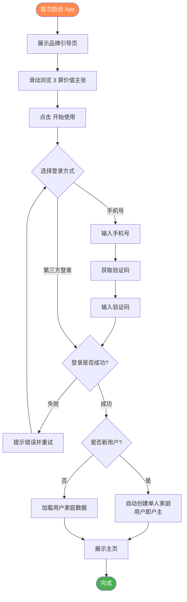

### 3.4 关键设计决策

| 决策点           | 选择                                                                                                    |
| ---------------- | ------------------------------------------------------------------------------------------------------- |
| 引导页屏数       | 3 屏                                                                                                    |
| 是否可跳过引导   | ✅ 可跳过                                                                                               |
| 登录方式         | **手机号 OTP（主）+ 邮箱密码 + Apple（次）**；登录即注册、无独立注册页；仅 +86 大陆（GoTrue 原生 + Send SMS Hook → 阿里云短信，详见 MVP.md §5、TECH §7.3） |
| 新用户家庭创建   | 自动创建单人家庭                                                                                        |
| 家庭信息完善     | ❌ 暂不做（已去掉「新用户完善家庭」步骤）；家庭名 / 封面改由户主在家庭设置页设置（见 §3.5）             |
| 是否引导加入家庭 | ❌ 不强制，用户可后续邀请或被邀请                                                                       |

### 3.5 家庭信息设置（名称 / 封面）

家庭名与封面用于家庭页头、加入家庭预览卡（流程 4）等处展示。

> **2026-06-26 订正**：原「创建侧·新用户可选『完善家庭』步骤」**已去掉，暂不做**——注册自动创建单人家庭后直接进主页，家庭名用默认名、封面用默认占位（中性灰底，DESIGN §5.6）。家庭名 / 封面统一在**家庭设置页**由户主修改。

- **修改侧（家庭设置页，已实现）**：「家庭」Tab → 家庭管理 → **家庭设置**入口，**仅户主**可修改家庭名与封面；普通成员只读。

| 决策点            | 选择                                                          | 理由                             |
| ----------------- | ------------------------------------------------------------- | -------------------------------- |
| 封面是否必填      | 否；无封面用默认占位（中性灰底）                              | 不阻断上手                       |
| 封面来源          | 系统预设图库 + 自定义上传（与储蓄目标封面一致，存阿里云 OSS） | 复用既有图库与上传链路           |
| 谁可改家庭名/封面 | **仅户主**（与户主权限一致，见 §2.1）                         | 家庭名是解散二次确认凭据，需受控 |
| 数据字段          | `FAMILY.cover_url`（DATAMODEL §3.2）                          | 单一信源                         |

---

## 4. 流程 2：快速记一笔账

### 4.1 流程目标

让用户在主页能用最少的步骤完成一次记账，金额是唯一必填项。

### 4.2 入口

- 「➕ 记一笔」悬浮圆钮（固定在底部 Tab Bar 右上方，四 Tab 下常驻；主操作入口）

### 4.3 流程图

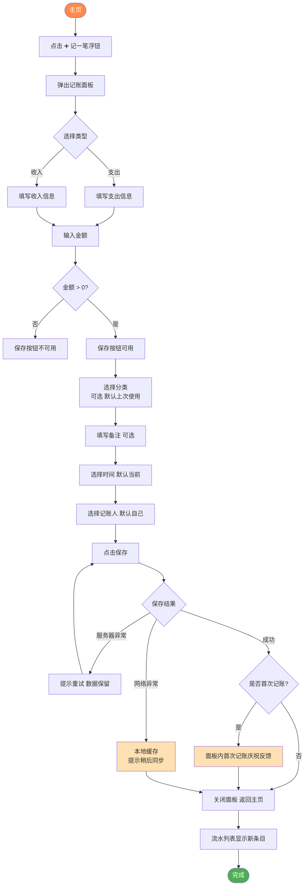

### 4.4 字段定义

| 字段   | 是否必填 | 默认值                                                           | 说明                                                   |
| ------ | -------- | ---------------------------------------------------------------- | ------------------------------------------------------ |
| 类型   | ✅       | 支出                                                             | 支出 / 收入                                            |
| 金额   | ✅       | -                                                                | 大于 0 才可保存                                        |
| 分类   | ❌       | 上次使用的分类（首次记账无「上次」时，落到系统预设「其他」分类） | 系统预设 + 自定义                                      |
| 备注   | ❌       | 空                                                               | 自由文本                                               |
| 时间   | ❌       | 当前时间                                                         | 可调整为过去时间                                       |
| 记账人 | ❌       | 当前登录用户                                                     | 仅限家庭成员；**单人家庭时隐藏该字段**，多人家庭才出现 |

### 4.5 关键设计决策

| 决策点   | 选择                 |
| -------- | -------------------- |
| 记账类型 | 仅支出 / 收入        |
| 默认 Tab | 支出                 |
| 必填字段 | 仅金额               |
| 默认分类 | 上次使用的分类       |
| 离线策略 | 本地优先，联网后同步 |

### 4.6 异常处理

| 异常场景        | 处理方式                   |
| --------------- | -------------------------- |
| 网络异常        | 本地缓存，联网后自动同步   |
| 服务器异常      | 提示重试，数据保留在面板中 |
| 金额为 0 或为负 | 保存按钮不可用             |

> 已记录的流水如需修改或删除，见 §12 流程 10：编辑 / 删除流水。

---

## 5. 流程 3：户主邀请家人加入

### 5.1 流程目标

让户主用最简单的方式（一串 6 位文本邀请码 + 一张同源二维码）邀请家人加入家庭，二者指向同一邀请，家人可任选扫码或手输。

### 5.2 前置条件

- 当前用户为户主
- 家庭成员数 < 8 人

### 5.3 流程图

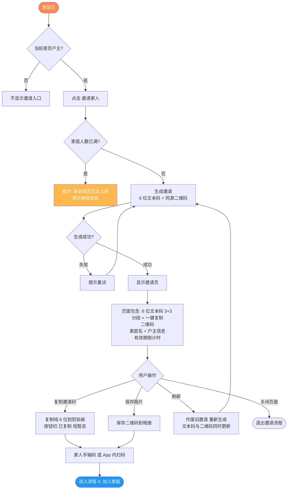

### 5.4 关键设计决策

| 决策点                | 选择                                                         | 理由                                |
| --------------------- | ------------------------------------------------------------ | ----------------------------------- |
| 邀请方式              | 6 位文本邀请码 + 同源二维码（手输 / 扫码任选）               | 文本码便于转发，二维码便于当面加入  |
| 邀请码格式            | 6 位，大写 A–Z + 数字 0–9，**排除易混 `0/O/1/I`**            | 段输入易读、口述 / 手输不易错       |
| 文本码展示            | 6 位 **3+3 分段**展示 + 「一键复制」按钮（含"已复制"反馈态） | 易读易口述 / 手抄，降低对方手输出错 |
| 文本码与二维码关系    | 同一条邀请记录的两种呈现，刷新 / 失效同步                    | 避免两套口径                        |
| 二维码 / 文本码有效期 | 24 小时                                                      | 平衡安全性与易用性                  |
| 是否限次数            | 不限                                                         | 户主可随时刷新                      |
| 家庭成员上限          | 8 人（含户主）                                               | 覆盖大部分家庭场景                  |
| 加入身份              | 统一为普通成员                                               | 户主仅一人，权限清晰                |

### 5.5 异常处理

| 异常场景           | 处理方式                                             |
| ------------------ | ---------------------------------------------------- |
| 非户主访问         | 邀请入口不显示                                       |
| 家庭人数已满       | 弹窗提示，引导去管理成员                             |
| 邀请生成失败       | 提示重试                                             |
| 邀请过期           | 自动提示「已过期，请刷新」（文本码与二维码同时失效） |
| 户主权限期间被变更 | 邀请立即失效（服务端校验）                           |

---

## 6. 流程 4：加入家庭（输入邀请码 / 扫码）

### 6.1 流程目标

让被邀请人通过**手输 6 位邀请码**或**扫码**加入家庭，在确认家庭信息与「加入对当前家庭数据的影响」后再加入。

### 6.2 入口

- 「家庭页」/「我的页」的**加入家庭**入口（默认手输邀请码，可「改用扫码」）

### 6.3 流程图

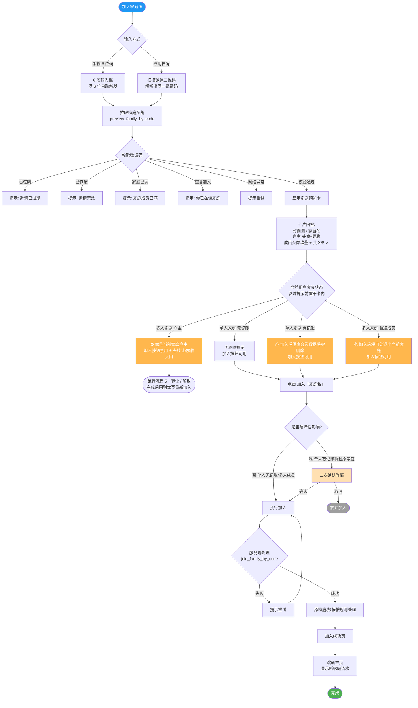

### 6.4 关键设计决策

| 决策点                     | 选择                                                                                        | 理由                                   |
| -------------------------- | ------------------------------------------------------------------------------------------- | -------------------------------------- |
| 输入方式                   | 手输 6 段邀请码为主、扫码为辅，**收敛到同一张预览卡确认**                                   | 一套确认逻辑，不做两套                 |
| 自动拉取时机               | 满 6 位即拉取（300–500ms 防抖）；**改动任一格立即清除上次结果、回到输入态**                 | 避免拿旧家庭信息加入                   |
| 家庭信息展示（隐私折中档） | 封面 + 家庭名 + 户主（显昵称 + 头像）+ 成员（**仅头像堆叠 + 人数，不显成员昵称**）          | 够确认"加入谁家、多大规模"，少暴露成员 |
| 加入影响提示               | **户主阻止态**在卡内前置并禁用加入；**破坏性影响**（原家庭 + 数据删除）保留点加入后二次确认 | 早拦截户主、强确认破坏性               |
| 一人多家                   | 不允许，仅属一个家庭                                                                        | 数据归属清晰                           |
| 户主直接加入新家庭         | 不允许，需先转让或解散（见流程 5）                                                          | 防止家庭无人管理                       |
| 单人家庭加入新家庭         | 原家庭直接删除（含数据）                                                                    | 数据归属于家庭                         |
| 多人家庭加入新家庭         | 自动退出，历史数据保留在原家庭                                                              | 与退出规则一致                         |
| 是否需户主审批             | 不需要                                                                                      | 简化流程，户主可后续移除               |

### 6.5 异常处理

| 异常场景           | 处理方式                                                           |
| ------------------ | ------------------------------------------------------------------ |
| 非本 App 二维码    | 提示「无法识别的二维码」                                           |
| 邀请码过期 / 作废  | 卡片不出现，提示并引导联系户主                                     |
| 家庭已满           | 提示无法加入                                                       |
| 已是该家庭成员     | 提示「你已经在这个家了」                                           |
| 当前是户主身份     | 卡内前置 ⛔ 提示并禁用加入，引导先转让或解散；完成后回本页重新输入 |
| 输入中途改动       | 清除已拉取的预览卡，回到输入态，不残留旧家庭信息                   |
| 离线               | 加入家庭为**在线操作**；离线时整页「需联网」兜底，不进离线队列     |
| 服务端处理超时     | 加载态超过 10s 提示重试                                            |
| 预览接口被高频试码 | 服务端按 IP / 设备 / 失败次数限频（防邀请码枚举，详见 TECH §7.3）  |

---

## 7. 流程 5：户主转让 & 退出家庭

### 7.1 流程目标

让户主可控、体面地离开家庭，并保证家庭不会陷入无人管理状态；普通成员可直接退出。

### 7.2 前置规则

- 户主不能直接退出，必须先**转让**或**解散**
- 普通成员可直接退出
- 转让对象仅限当前家庭的其他成员

### 7.3 流程图

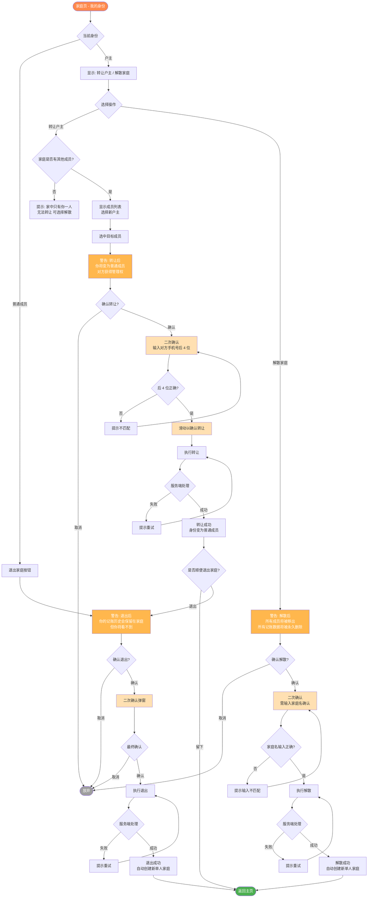

### 7.4 关键设计决策

| 决策点              | 选择                             | 理由                                             |
| ------------------- | -------------------------------- | ------------------------------------------------ |
| 户主能否直接退出    | 不能，必须先转让或解散           | 防止家庭无人管理                                 |
| 转让二次确认方式    | 输入对方手机号后 4 位 + 滑动确认 | 比昵称稳定（昵称可重复/可改），防误操作 + 仪式感 |
| 转让成功后引导      | 询问是否顺便退出家庭             | 多数转让动机即为离开，减少二次操作               |
| 解散二次确认方式    | 输入家庭名                       | 强烈警示破坏性操作                               |
| 退出后历史数据      | 保留在家庭                       | 数据归属于家庭                                   |
| 退出/解散后用户状态 | 自动创建单人家庭                 | 保证基础可用                                     |
| 转让是否可撤销      | 不可                             | 鼓励谨慎决策                                     |

### 7.5 异常处理

| 异常场景          | 处理方式                       |
| ----------------- | ------------------------------ |
| 户主是唯一成员    | 阻止转让，引导邀请或解散       |
| 转让目标已退出    | 提示并刷新成员列表             |
| 解散后数据恢复    | 不支持，永久删除               |
| 转让/解散网络中断 | 服务端事务保证一致性，提示重试 |

### 7.6 户主长期不活跃的继任机制

解决「户主失联 / 卸载导致家庭无人可管（无法邀请、移除、设预算、删目标）」的死锁问题。

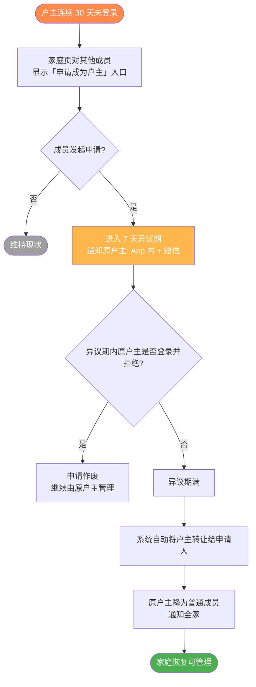

| 决策点                   | 选择                                 | 理由                         |
| ------------------------ | ------------------------------------ | ---------------------------- |
| 触发不活跃阈值           | 连续 30 天未登录                     | 平衡误判风险与解锁及时性     |
| 谁可发起继任申请         | 任意现有成员                         | 任何在用成员都可解锁家庭     |
| 原户主异议期             | 7 天                                 | 给原户主回归并保留权利的窗口 |
| 异议期内原户主登录并拒绝 | 申请作废                             | 尊重在用户主的管理权         |
| 多人同时申请             | 以首个申请为准，异议期内不接受新申请 | 避免冲突                     |

---

## 8. 流程 6：户主移除成员

### 8.1 流程目标

户主在必要时可以移除家庭成员，同时保护被移除者的知情权与基础可用性。

### 8.2 前置规则

- 仅户主有移除权限
- 户主不能移除自己（应走流程 5）
- 被移除者历史记账保留在家庭

### 8.3 流程图

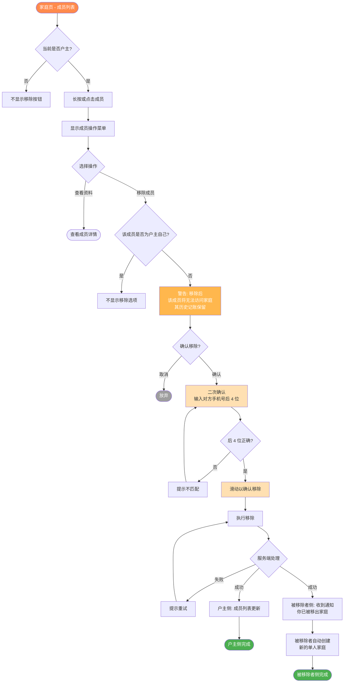

### 8.4 关键设计决策

| 决策点           | 选择                             | 理由                             |
| ---------------- | -------------------------------- | -------------------------------- |
| 移除二次确认     | 输入对方手机号后 4 位 + 滑动确认 | 与转让一致，比昵称稳定，防误操作 |
| 是否通知被移除者 | 通知                             | 保护知情权                       |
| 被移除者历史数据 | 保留在家庭                       | 与退出规则一致                   |
| 被移除者后续状态 | 自动创建单人家庭                 | 保证基础可用                     |
| 是否支持批量移除 | 不支持                           | 高风险操作，逐个确认更安全       |
| 是否记录移除日志 | 服务端日志                       | 便于纠纷追溯                     |

### 8.5 异常处理

| 异常场景                | 处理方式                           |
| ----------------------- | ---------------------------------- |
| 户主试图移除自己        | 不显示移除选项                     |
| 被移除者正在 App 内操作 | 下次心跳/请求时被踢出，全屏提示    |
| 被移除者已主动退出      | 提示并刷新成员列表                 |
| 户主权限刚被转让        | 移除请求被拒，提示「你已不是户主」 |

---

---

## 9. 流程 7：储蓄目标（共同攒钱）

### 9.1 流程目标

让一家人共同设定一个攒钱目标（如"换车基金""全家旅行"），并能持续看到进度，把记账从"消费记录"升华为"共同奋斗"的家庭仪式感。

### 9.2 核心概念

| 概念           | 说明                                                                                                                                  |
| -------------- | ------------------------------------------------------------------------------------------------------------------------------------- |
| **储蓄目标**   | 一个具名的攒钱计划，含目标金额、截止日期                                                                                              |
| **存入**       | 主动往目标里"存"一笔钱，**同步生成一笔特殊支出流水**（分类「储蓄·目标存入」）                                                         |
| **取出**       | 从目标中支取，可填写用途备注，**同步生成一笔特殊收入流水**（分类「储蓄·目标取出」）                                                   |
| **进度**       | 当前已存金额 / 目标金额                                                                                                               |
| **储蓄类流水** | 上述存入/取出生成的流水，参与「家庭资金对账（收入/支出/结余）」，但**不计入日常消费分析（分类占比、消费趋势）**，亦**不计入预算统计** |

### 9.3 前置规则

- **所有成员**均可创建、存入、取出
- **仅户主**可删除目标
- 一个家庭最多同时存在 **5 个**进行中的目标

### 9.4 流程图

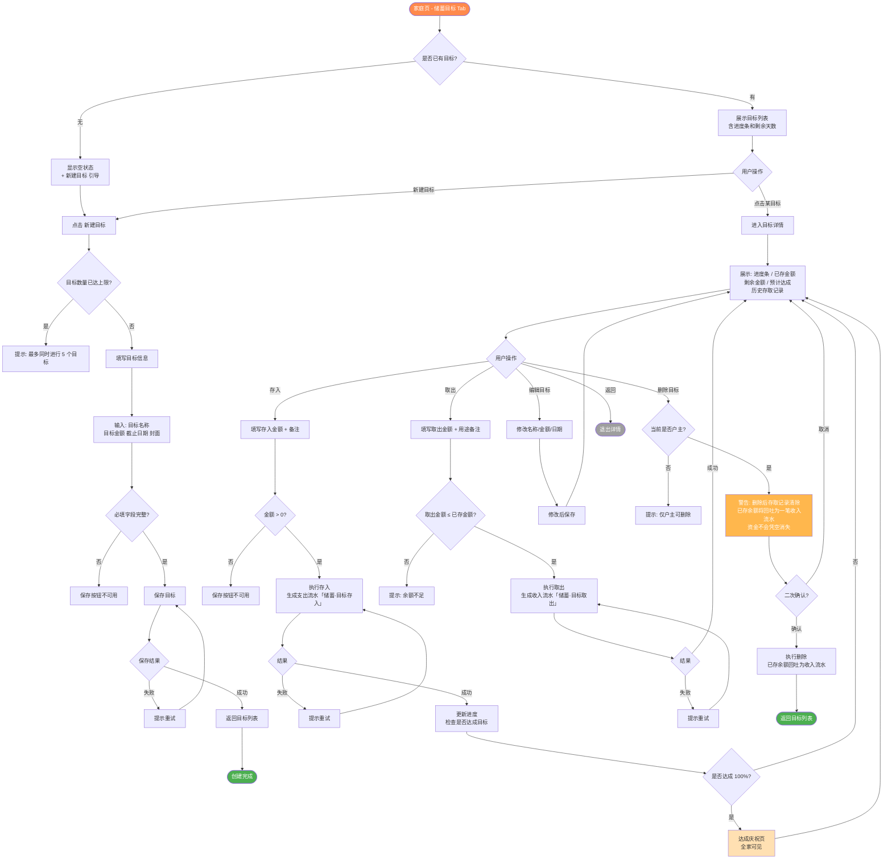

### 9.5 字段定义（新建目标）

| 字段     | 是否必填 | 说明                      |
| -------- | -------- | ------------------------- |
| 目标名称 | ✅       | 如"全家三亚游"            |
| 目标金额 | ✅       | 大于 0                    |
| 截止日期 | ❌       | 默认为空（无期限）        |
| 封面图   | ❌       | 系统预设图库 + 自定义上传 |
| 备注     | ❌       | 自由文本                  |

### 9.6 关键设计决策

| 决策点                     | 选择                                      | 理由                                               |
| -------------------------- | ----------------------------------------- | -------------------------------------------------- |
| 谁可以创建目标             | 所有成员                                  | 鼓励家庭参与感                                     |
| 谁可以存入/取出            | 所有成员                                  | 共同奋斗                                           |
| 谁可以删除目标             | 仅户主                                    | 防止误删共同成果                                   |
| 目标数量上限               | 5 个                                      | 避免目标过多失焦                                   |
| 存入/取出是否记入流水      | ✅ 记入（特殊分类「储蓄·目标存入/取出」） | 保证家庭资金可对账，钱不会凭空蒸发                 |
| 储蓄类流水是否计入消费分析 | ❌ 不计入（仅参与收入/支出/结余对账）     | 让用户清晰区分「日常消费」与「攒钱」两类，账能对上 |
| 储蓄类流水是否计入预算     | ❌ 不计入                                 | 攒钱不应吃掉日常消费预算                           |
| 删除目标的已存余额         | 回吐为一笔收入流水                        | 资金守恒，家庭结余始终对得上                       |
| 达成后是否自动归档         | ❌ 保留可见                               | 让全家持续看到成果                                 |
| 目标金额改至低于已存额     | 允许，进度封顶 100%，不重复触发庆祝       | 庆祝仅在首次达成触发一次                           |

### 9.7 异常处理

| 异常场景               | 处理方式                                            |
| ---------------------- | --------------------------------------------------- |
| 目标数量已达上限       | 阻止创建并提示                                      |
| 取出金额超过余额       | 阻止操作并提示                                      |
| 截止日期早于当前       | 阻止保存并提示                                      |
| 编辑目标金额低于已存额 | 允许保存，进度封顶 100%，若此前已达成则不再重复庆祝 |
| 删除目标网络异常       | 提示重试，目标状态保持                              |
| 存入/取出并发冲突      | 服务端版本号校验，失败则刷新重试                    |

---

## 10. 流程 8：预算管理

### 10.1 流程目标

让家庭设定月度预算，及时看到"花了多少 / 还剩多少"，避免月底超支才后知后觉。

### 10.2 核心概念

| 概念         | 说明                                        |
| ------------ | ------------------------------------------- |
| **总预算**   | 整个家庭的月度支出上限                      |
| **分类预算** | 针对某个支出分类的月度上限（如"餐饮 2000"） |
| **预算周期** | 默认按自然月滚动（每月 1 日重置）           |

### 10.3 前置规则

- **仅户主**可设置/调整预算
- 所有成员**均可查看**预算执行情况
- 预算仅针对**支出**，不限制收入

### 10.4 流程图

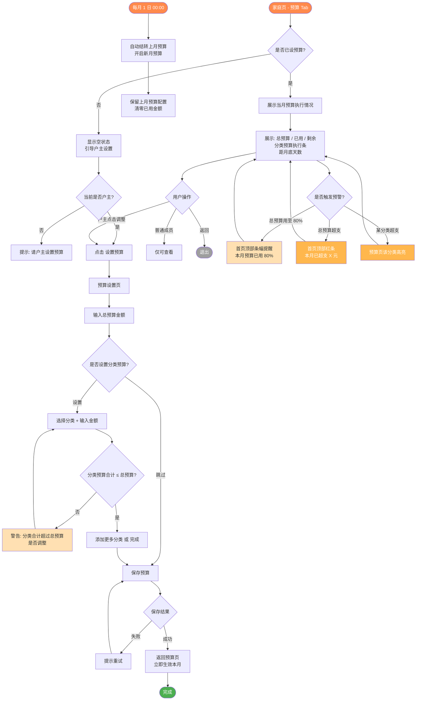

### 10.5 字段定义（设置预算）

| 字段         | 是否必填 | 说明                 |
| ------------ | -------- | -------------------- |
| 总预算金额   | ✅       | 大于 0               |
| 分类预算     | ❌       | 可选，0~N 个         |
| 是否启用预警 | ✅       | 默认开启（80% 提醒） |

### 10.6 关键设计决策

| 决策点                     | 选择                                                                    | 理由                                   |
| -------------------------- | ----------------------------------------------------------------------- | -------------------------------------- |
| 谁可以设置预算             | 仅户主                                                                  | 财务规划权威性                         |
| 谁可以查看                 | 所有成员                                                                | 透明协作                               |
| 预算周期                   | 自然月（每月 1 日重置）                                                 | 符合大众心理账户                       |
| 分类预算是否强制           | ❌ 可选                                                                 | 降低使用门槛                           |
| 分类合计是否必须等于总预算 | ❌ 仅警告                                                               | 灵活性优先                             |
| 预警阈值                   | 80% 提醒 / 100% 超支告警                                                | 经典区间                               |
| 预警条幅口径               | 一律按**总预算**计算（已用 ÷ 总预算）；分类超支只在该分类执行条单独高亮 | 总览与分类明细口径分离，避免混淆       |
| 「已用」金额口径           | 仅统计日常支出流水，**排除储蓄类流水（目标存入/取出）**                 | 攒钱不挤占日常消费预算，与报表口径一致 |
| 超支后是否阻止记账         | ❌ 不阻止                                                               | 预算是参考，不是限制                   |
| 上月预算是否结转           | ❌ 不结转                                                               | 每月独立，简化模型                     |

### 10.7 异常处理

| 异常场景               | 处理方式                       |
| ---------------------- | ------------------------------ |
| 普通成员尝试设置预算   | 入口不可用，提示「请户主设置」 |
| 分类预算合计超过总预算 | 警告但允许保存（用户决定）     |
| 月中调整预算           | 立即生效，不影响已记账数据     |
| 月初自动重置失败       | 服务端补偿任务，最迟次日恢复   |
| 删除某分类后该分类预算 | 自动失效，从展示中隐藏         |

---

## 11. 流程 9：月度总结 / 报表查看

### 11.1 流程目标

让家庭成员轻松看清"这个月家里钱花在哪了"，把零散的记账数据转化为有意义的洞察，并在每月初给出一份温暖的月度总结作为家庭仪式感节点。

### 11.2 核心概念

| 概念           | 说明                                       |
| -------------- | ------------------------------------------ |
| **报表中心**   | 集中查看收支统计、分类占比、成员贡献的页面 |
| **月度总结卡** | 每月 1 日自动生成的上月总结（卡片形式）    |
| **时间维度**   | 周 / 月 / 年 三个粒度切换                  |

### 11.3 前置规则

- 所有家庭成员均可查看
- 报表数据基于当前家庭的所有流水
- 月度总结仅在有记账数据的月份生成

### 11.4 流程图

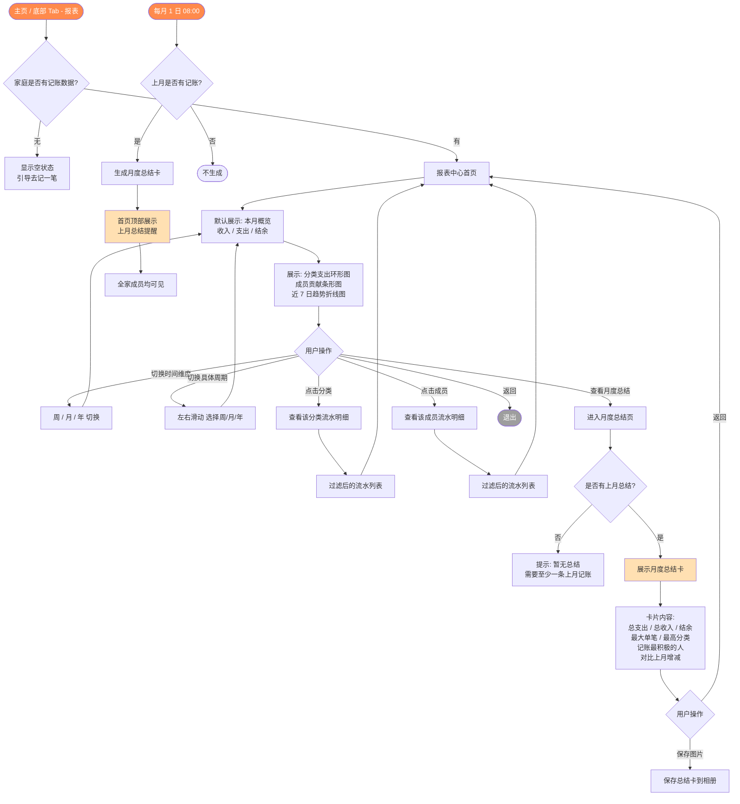

### 11.5 报表内容定义

#### 11.5.1 报表中心 - 主体内容

> 阶段：P0＝M3 基础版；P1＝M4 完整版；远期＝P1 之后按数据反馈再评估。
> 口径脚注见表下。

| 模块           | 内容                                   | 推荐图表类型                           | 阶段          | 口径   |
| -------------- | -------------------------------------- | -------------------------------------- | ------------- | ------ |
| 本期概览       | 当期收入 / 支出 / 结余，每项附**环比** | 数字卡片（带 ↑↓ 环比角标）             | P0            | ¹      |
| 结余率         | 结余 ÷ 收入                            | 数值标签（P0）→ 环形仪表 Gauge（P1）   | P0 值 / P1 图 | ¹      |
| 日均 / 笔均    | 日均支出、笔均金额                     | 数值（附于概览卡）                     | P0 可选       | ²      |
| 支出分类占比   | 各支出分类金额与占比                   | 环形图（Donut）+ 明细列表              | P0            | ²      |
| 分类环比       | 各分类金额相对上期增减                 | 明细列表带 Δ（主）/ 横向条形图（可选） | P1            | ²      |
| 收支趋势       | 近 7 日 / 近 30 日 / 近 12 月 发生额   | 折线图                                 | P1            | ²      |
| 累计同期对比   | 本期至今累计支出 vs 上期同期累计       | 双线折线图（累计 / 面积）              | P1            | ²      |
| 收支对比       | 收入 vs 支出                           | 分组双柱图                             | P1            | ¹      |
| 成员参与度     | 各成员记账**笔数**（参与度，不含金额） | 横向条形图（笔数）                     | P1            | ³      |
| 大额支出 Top N | 本期最大 3–5 笔支出                    | 排行列表（可选横向条形）               | P1            | ²      |
| 收入结构       | 各收入分类占比                         | 环形图 / 横向条形                      | P1 可选       | 收入侧 |
| 消费日历热力图 | 按天消费强度                           | 日历热力图（自定义 Skia）              | 远期 可选     | ²      |

**口径脚注**

- ¹ **对账口径**：含储蓄类流水（`source != normal`），与首页概览、家庭资金对账一致。
- ² **消费口径**：仅 `source = normal` 流水，排除储蓄存入 / 取出，对应日常消费分析。
- ³ **参与度口径**：统计记账行为本身（笔数），不区分流水性质、不计消费金额。

**下钻规则**

- 点击分类 → 该分类流水明细（消费口径）。
- 点击成员 → 该成员**记账明细**（参与度视角，不做「花了多少」排名）。
- 时间维度切换：周 / 月 / 年（默认月）；左右滑动切换具体周期。

**图表实现备注（对齐 DESIGN 实现策略）**

- 环形图 / 折线 / 面积 / 双柱 → Victory Native XL（`@shopify/react-native-skia`）。
- 横向条形（成员参与度、分类环比）→ Victory Native XL 无现成横向 Bar；优先用 `@expo/ui/swift-ui` 原生行 + 内嵌比例条实现，或 Skia 自绘，避免为单一图型引入旋转坐标轴的复杂度。
- 结余率仪表 → 优先原生 `Gauge` / `CircularProgress`，不足再 Skia。
- 大额 Top N / 数字卡 → 原生件，不走图表库。
- 日历热力图 → 自定义 Skia（远期）。

#### 11.5.2 月度总结卡 - 内容字段

| 字段           | 示例                                                 |
| -------------- | ---------------------------------------------------- |
| 月份           | 2026 年 5 月                                         |
| 总支出         | ¥ 8,432                                              |
| 总收入         | ¥ 15,000                                             |
| 结余           | ¥ 6,568                                              |
| 最大单笔支出   | ¥ 1,200（餐饮 · 5 月 12 日）                         |
| 支出最高分类   | 餐饮 ¥ 3,400（占 40%）                               |
| 记账最积极的人 | 老王（共记 23 笔）                                   |
| 对比上月       | 支出 ↓ 12% / 收入 ↑ 5%                               |
| 暖心一句话     | "这个月你们一起记下了 47 笔，每一笔都是生活的痕迹。" |

> 月度总结卡为静态卡片（无交互图表），「记账最积极的人」与报表成员维度同源，统一为参与度（笔数）口径。

### 11.6 关键设计决策

| 决策点              | 选择                                                                 | 理由                                                |
| ------------------- | -------------------------------------------------------------------- | --------------------------------------------------- |
| 默认时间维度        | 月                                                                   | 最贴合家庭财务节奏                                  |
| 时间维度切换        | 周 / 月 / 年 三档（周 / 年为 P1）                                    | 覆盖大多数查看场景                                  |
| 是否区分成员视角    | ❌ 全家共享同一份报表                                                | 数据归属于家庭                                      |
| 成员维度口径        | **纯参与度（记账笔数）；不展示、不排名消费金额**                     | 共享账本中记账人 ≠ 消费人，按金额排名易引发家庭矛盾 |
| 概览数字呈现        | **每个数字附环比；同比待满 12 月数据后（P1）**                       | 单纯数字无对比则无洞察                              |
| 结余率口径          | **结余 ÷ 收入，同对账口径（含储蓄类）**                              | 全 App 单一「结余」概念，避免二义                   |
| 趋势两种读法        | **发生额折线 + 累计同期对比双线 并存**                               | 发生额看波动，累计同期看「是否在轨」                |
| 分类分析侧重        | **占比（结构）+ 环比（变化）并重**                                   | 占比定位结构，环比指导行动                          |
| 大额支出呈现        | **常驻「本期最大 N 笔」列表，不止于月度总结**                        | 家庭超支多由少数大额驱动，需快速定位                |
| 图表库口径          | **主体图表 Victory Native XL；横向条形 / 进度类优先原生件或 Skia**   | 对齐 DESIGN 实现策略，避免为单图型引复杂度          |
| 收入结构 / 消费日历 | 列为 P1 可选 / 远期                                                  | 控制报表复杂度，避免过载                            |
| 月度总结生成时机    | 每月 1 日 08:00                                                      | 早晨打开 App 即可看到                               |
| 月度总结展示位置    | 首页顶部条幅 + 报表 Tab 入口                                         | 双入口曝光                                          |
| 是否支持导出        | 仅「保存图片」                                                       | MVP 阶段足够，后续可扩展                            |
| 储蓄类流水如何统计  | 计入收入 / 支出 / 结余总额（保证对账）；**不计入分类占比、消费趋势** | 资金能对上账，又不污染日常消费分析                  |
| 是否包含预算执行    | ❌ 预算有独立 Tab                                                    | 避免报表过载                                        |
| 暖心文案            | 系统预设文案池随机                                                   | 增加情感温度，避免机械感                            |

### 11.7 异常处理

| 异常场景         | 处理方式                                                                                                   |
| ---------------- | ---------------------------------------------------------------------------------------------------------- |
| 家庭无任何记账   | 报表页显示空状态，引导去记账                                                                               |
| 上月无记账       | 月度总结不生成，不在首页展示                                                                               |
| 切换周期无数据   | 该周期内显示"暂无数据"占位                                                                                 |
| 数据加载失败     | 提示重试，保留上次缓存数据                                                                                 |
| 月度总结生成失败 | 服务端补偿任务，最迟当日 12:00 恢复                                                                        |
| 成员退出后报表   | 历史数据仍计入家庭总额，且**保留该成员名称条目**（在「成员贡献」中视作仍在，仅实际已退出，金额归属不丢失） |

### 11.8 暖心文案池（示例）

> 文案在月度总结卡底部随机展示，体现"家账"的温度

```
"这个月你们一起记下了 47 笔，每一笔都是生活的痕迹。"
"5 月家里最大的开销是餐饮——是不是又多吃了几顿好的？"
"和上个月相比，家里省下了 1,200 元，给自己点个赞。"
"老王是这个月记账最勤快的人，给他一个家庭勋章 🏅"
"这个月的结余可以存进『全家三亚游』里，距离目标更近一步啦。"
```

---

## 12. 流程 10：编辑 / 删除流水

### 12.1 流程目标

让用户能修正记错的流水（金额、分类、记账人等）或删除多余记账，并保证预算、报表等聚合数据同步重算，构成记账的完整闭环。

### 12.2 权限规则

| 角色         | 编辑           | 删除           |
| ------------ | -------------- | -------------- |
| 记账人本人   | ✅             | ✅             |
| 户主         | ✅（任何人的） | ✅（任何人的） |
| 其他普通成员 | ❌ 仅查看      | ❌             |

> 储蓄类流水（目标存入 / 取出）不可在流水页直接编辑或删除，需在对应储蓄目标内操作，以保持资金闭环一致。

### 12.3 流程图

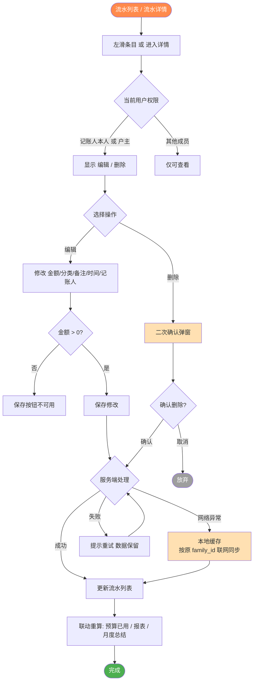

### 12.4 关键设计决策

| 决策点          | 选择                                    | 理由                                 |
| --------------- | --------------------------------------- | ------------------------------------ |
| 谁可编辑 / 删除 | 记账人本人 + 户主                       | 便利与兜底兼顾，避免成员互删起争执   |
| 删除二次确认    | 普通弹窗确认（无需输入文字）            | 单笔影响有限，与解散等高破坏操作区分 |
| 储蓄类流水      | 不可在流水页直接编辑 / 删除             | 保持资金闭环一致                     |
| 编辑 / 删除后   | 联动重算预算已用、报表、月度总结        | 保证聚合数据一致                     |
| 离线编辑 / 删除 | 进入本地同步队列，按原 `family_id` 同步 | 与新增记账一致，防串账               |

### 12.5 异常处理

| 异常场景          | 处理方式                              |
| ----------------- | ------------------------------------- |
| 无编辑 / 删除权限 | 不显示对应入口                        |
| 流水已被他人删除  | 提示「该记录已不存在」并刷新列表      |
| 编辑跨越家庭归属  | 始终按原 `family_id` 处理，不改变归属 |
| 网络异常          | 本地缓存，联网后自动同步              |
| 服务器异常        | 提示重试，数据保留                    |

---

## 13. 流程 11：自定义分类管理

### 13.1 流程目标

让家庭可以维护自己的支出 / 收入分类，同时保证删除分类时历史流水不残缺、关联预算可控。

### 13.2 前置规则

- 所有成员均可**新增 / 编辑**分类
- **仅户主**可停用（删除）自定义分类
- 系统预设分类**不可删除**，仅可隐藏
- 删除采用**软删除（归档 / 停用）**，不物理删除

### 13.3 流程图

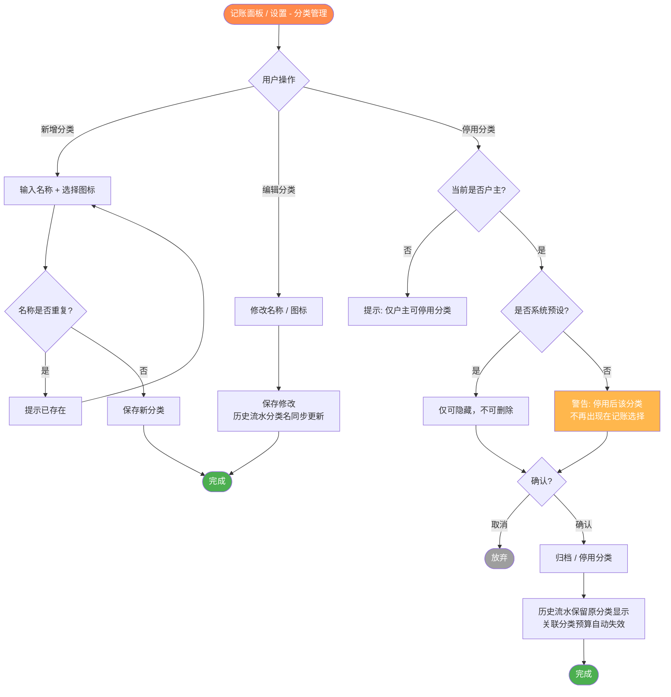

### 13.4 关键设计决策

| 决策点          | 选择                   | 理由                             |
| --------------- | ---------------------- | -------------------------------- |
| 谁可新增 / 编辑 | 所有成员               | 鼓励家庭参与                     |
| 谁可停用        | 仅户主                 | 影响全家历史与预算               |
| 删除方式        | 软删除（归档 / 停用）  | 保留历史流水可读性，避免数据残缺 |
| 系统预设分类    | 不可删，仅可隐藏       | 保证基础可用                     |
| 停用后历史流水  | 保留原分类显示         | 数据不残缺                       |
| 停用后分类预算  | 自动失效，从展示中隐藏 | 与 §10 预算规则一致              |

---

## 14. 流程 12：账号注销（远期）

> **排期说明**：本流程列入**远期迭代**，MVP 暂不实现。户主失联导致的家庭死锁已由 §7.6「户主继任机制」兜底。

### 14.1 流程目标

为合规（用户有权注销账号）提供可控的注销路径，同时不破坏「数据归家」与「家庭不无人管理」两条根本规则。

### 14.2 前置规则

- **多人家庭户主**不能直接注销，须先转让或解散（复用流程 5 前置拦截）
- **单人家庭户主**注销 = 解散家庭 + 删除账号
- **普通成员**注销 = 自动退出家庭（历史记账保留在家庭）+ 删除账号

### 14.3 流程图

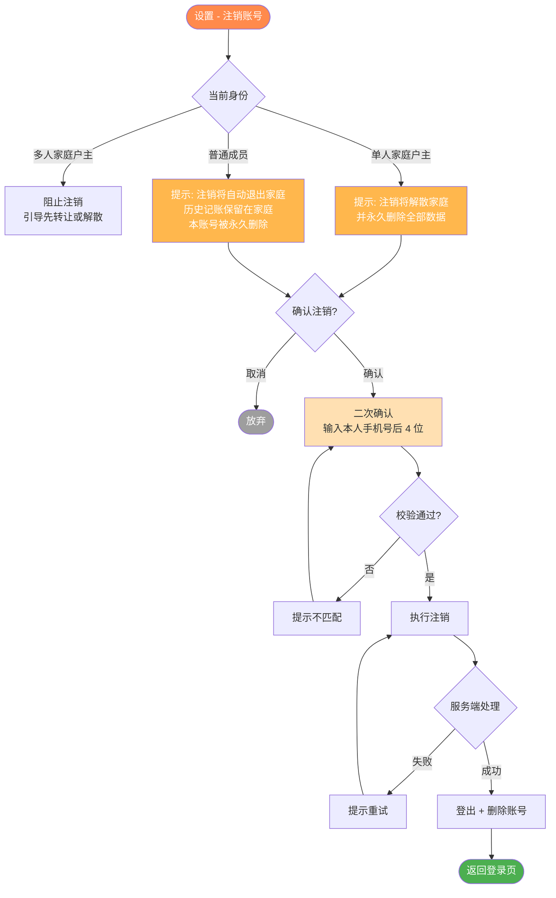

### 14.4 关键设计决策

| 决策点           | 选择                                        | 理由                     |
| ---------------- | ------------------------------------------- | ------------------------ |
| 户主能否直接注销 | 不能，须先转让 / 解散                       | 复用退出规则，防止死锁   |
| 普通成员注销     | 自动退出家庭 + 删除账号（历史记账保留家庭） | 合规可注销 + 数据归家    |
| 注销二次确认     | 输入本人手机号后 4 位                       | 防误操作                 |
| 数据是否可恢复   | 否，永久删除                                | 合规要求                 |
| 排期             | 远期迭代                                    | MVP 先以户主继任兜底死锁 |

---

## 15. 流程 13：通知体系

### 15.1 流程目标

为「被移除、户主变更、目标达成、预算预警、月度总结」等跨流程事件提供统一的触达机制，**保证关键状态变更不依赖系统推送权限也能被用户看到**。

### 15.2 核心原则

- **关键状态变更必须有 App 内兜底展示**（条幅 / 红点 / 通知中心），即使用户关闭了系统推送。
- 系统推送仅作为**唤回增强**，可被用户在系统层关闭。

### 15.3 触达通道

| 通道                             | 用途                                                  | 是否依赖系统权限 |
| -------------------------------- | ----------------------------------------------------- | ---------------- |
| App 内（条幅 / 红点 / 通知中心） | 被移除、户主转让 / 继任、目标达成、预算预警、月度总结 | 否（始终可见）   |
| 系统推送                         | 上述事件的推送副本，用于唤回                          | 是（可关闭）     |

### 15.4 流程图

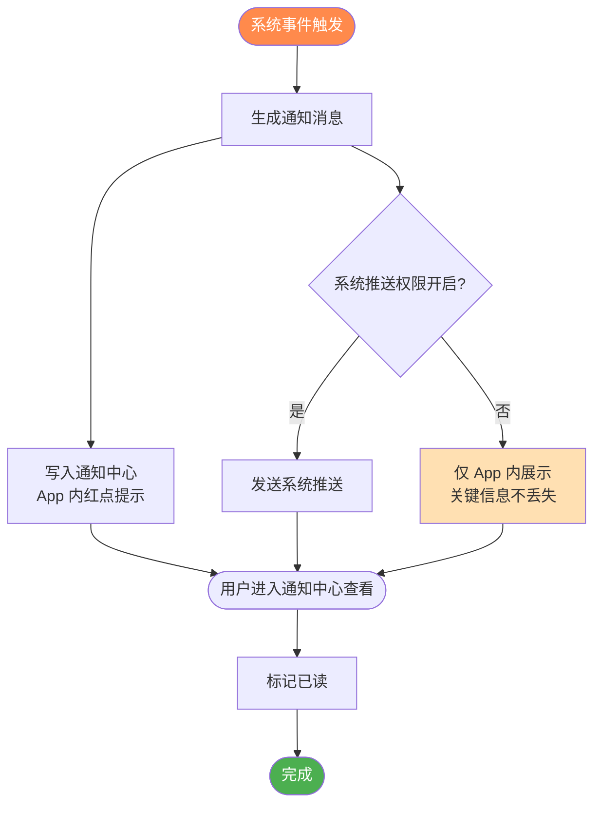

### 15.5 事件清单

| 事件                | App 内         | 系统推送          | 触达对象     |
| ------------------- | -------------- | ----------------- | ------------ |
| 被移出家庭          | ✅ 条幅 + 全屏 | ✅                | 被移除者     |
| 户主转让 / 继任完成 | ✅             | ✅                | 全家         |
| 户主继任申请异议期  | ✅             | ✅（短信 + 推送） | 原户主       |
| 储蓄目标达成        | ✅ 庆祝        | ✅                | 全家         |
| 预算预警 / 超支     | ✅ 首页条幅    | 可选              | 全家（查看） |
| 月度总结生成        | ✅ 首页条幅    | ✅                | 全家         |

---

## 16. 流程 14：搜索

### 16.1 流程目标

让成员在「找回某一笔流水」与「临时对账」两类场景下，通过关键词 + 多维筛选快速定位流水，并实时看到当前筛选结果的合计。

### 16.2 入口与形态

- **入口**：各 Tab 顶栏右上角 🔍 图标（「我的」页除外）。
- **形态**：**独立全屏页面**（导航栈 push 进入，带返回 / 取消），**非底部 Sheet / 抽屉**。
- **范围**：仅当前家庭（`current_family_id`）的流水，不跨家庭。

### 16.3 能力范围（首发 · B 档）

| 能力       | 说明                                                     |
| ---------- | -------------------------------------------------------- |
| 关键词     | 匹配流水备注 `note`，并命中分类名、成员昵称              |
| 类型筛选   | 支出 / 收入 / 不限                                       |
| 分类筛选   | 可多选                                                   |
| 成员筛选   | 按记账人，可多选                                         |
| 日期范围   | 本月 / 上月 / 近 7 天 / 近 30 天 / 今年 / 自定义         |
| 金额区间   | 最小值 / 最大值（任一可空）                              |
| 结果合计条 | 常驻：笔数 + 支出合计 + 收入合计 + 净额（口径同对账）    |
| 搜索历史   | 本地保留最近若干条关键词，可点击回填、单条删除、一键清空 |

> 维度间为 **AND** 组合（逐步收窄）。联想、常用搜索保存、自然语言解析为后置增强（见 §17 远期迭代候选）。

### 16.4 流程图

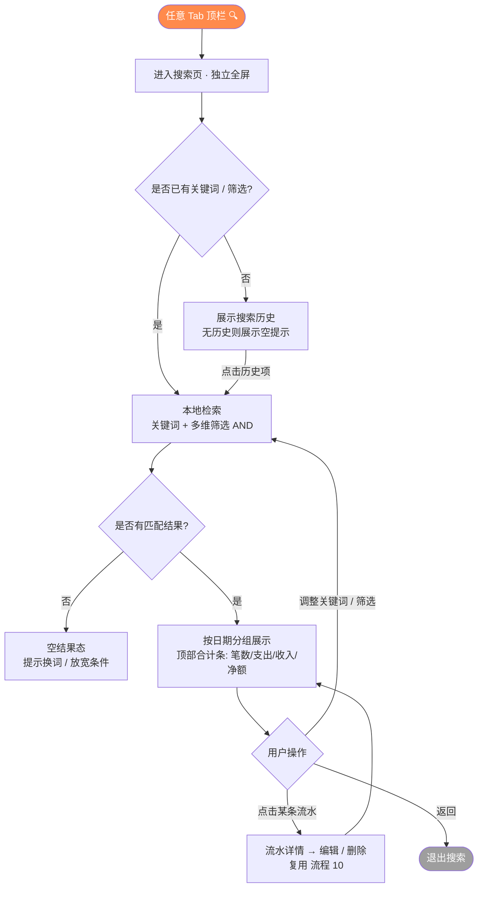

### 16.5 结果与交互定义

- **结果列表**：按日期分组，日期头含当日小计，样式与首页流水列表一致。
- **结果行**：分类图标 + 备注 / 分类名 + 成员 + 金额（红 = 收入 / 绿 = 支出）。
- **点击结果行** → 流水详情，编辑 / 删除复用 流程 10（§12）。
- **储蓄类流水**（`source != normal`）默认不计入合计；如在结果中展示则单独标注，金额不并入消费口径。
- **空态**：初始态展示搜索历史；无结果态展示空状态提示。

### 16.6 关键设计决策

| 决策点                     | 选择                              | 理由                                  |
| -------------------------- | --------------------------------- | ------------------------------------- |
| 页面形态                   | 独立全屏页（push），非 Sheet/抽屉 | 多维操作 + 长结果列表，独立页承载更稳 |
| 检索数据源                 | 本地 WatermelonDB                 | 家庭流水已全量离线，更快、无网亦可用  |
| 关键词匹配                 | 备注子串 + 分类名 / 成员名        | 首发够用；中文 FTS / 分词后置         |
| 维度组合                   | 维度间 AND                        | 符合逐步收窄的检索直觉                |
| 合计口径                   | 同对账，默认排除储蓄类            | 与首页 / 报表口径一致，避免数不一致   |
| 金额维度                   | 纳入首发（区间）                  | 记账高频诉求                          |
| 搜索范围                   | 仅当前家庭                        | 一人一家，跨家庭无意义                |
| 联想 / 常用搜索 / 自然语言 | 后置 P1                           | 非核心闭环                            |

### 16.7 异常处理

| 异常场景                | 处理方式                               |
| ----------------------- | -------------------------------------- |
| 关键词与筛选均为空      | 展示搜索历史（或空提示），不执行检索   |
| 无匹配结果              | 空结果态，提示换词或放宽条件           |
| 金额区间最小值 > 最大值 | 即时校验提示，不执行检索               |
| 自定义日期起 > 止       | 即时校验提示                           |
| 命中流水已被他人删除    | 点击时提示「该记录已不存在」并刷新结果 |
| 离线                    | 正常本地检索（数据源即本地），不受影响 |

### 16.8 数据 / 实现说明

- 检索走本地 WatermelonDB：`note` 子串匹配 + `amount` / `occurred_at` / `category_id` / `recorder_user_id` 条件过滤。
- 为搜索涉及字段（`occurred_at`、`category_id`、`recorder_user_id`）建立 WatermelonDB 索引；`note` 首发用子串匹配，中文分词 / FTS 列为后续增强。

---

## 17. 待办与后续迭代

### 核心流程

✅ 流程 1-14 已全部完成定义（含本次补充的搜索）。

### 后续待补充章节

- §17 信息架构（IA）与页面地图
- §18 数据模型（家庭 / 成员 / 流水 / 分类 / 储蓄目标 / 预算）——其中「流水绑定 `family_id`」「分类软删除」已在 §2.3、§13 约定
- §19 接口定义（与后端约定）
- §20 非功能需求（性能、安全、合规、可访问性）
- §21 MVP 范围与排期建议
- ✅ §22 视觉设计规范 —— 已独立成文，详见 `DESIGN.md`（中性黑白骨架 + Light / Night 两种模式、收支柔和语义色、**分层材质：系统 chrome 顺应 iOS 26 Liquid Glass、内容层保持实心**、设计令牌与组件落地映射）
- ✅ §23 技术选型与开发方案 —— 已独立成文，详见 `TECH.md`（客户端 React Native（Expo）+ TypeScript、报表图表、开发工具链、调试流程、里程碑排期、上架与盈利路径）

### 远期迭代候选（不在 MVP 范围）

- 账号注销（流程 12，已设计，待排期）
- 多家庭支持（一人多家）
- 账单导入（支付宝 / 微信账单）
- 周期性账单（房租、订阅）自动提醒
- 家庭财务报告导出（PDF / Excel）
- 资产管理（存款 / 投资 / 负债）
- 多币种支持

---

## 附录 A：术语表

| 术语     | 含义                                  |
| -------- | ------------------------------------- |
| 家庭     | 数据归属的最小单元，由 1-8 名成员组成 |
| 户主     | 家庭管理者，每个家庭仅一人            |
| 普通成员 | 受邀加入家庭的用户                    |
| 单人家庭 | 仅户主一人的家庭，用户注册时自动创建  |
| 流水     | 一条记账记录（支出或收入）            |
